# 

基本结构

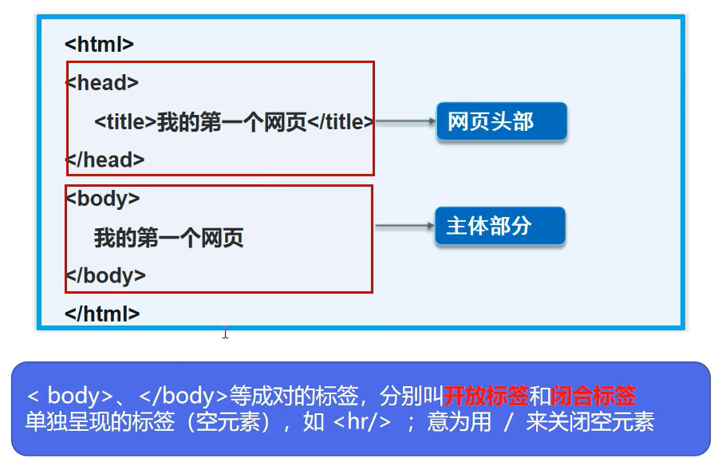


# 基本信息


效果:


# 网页基本标签

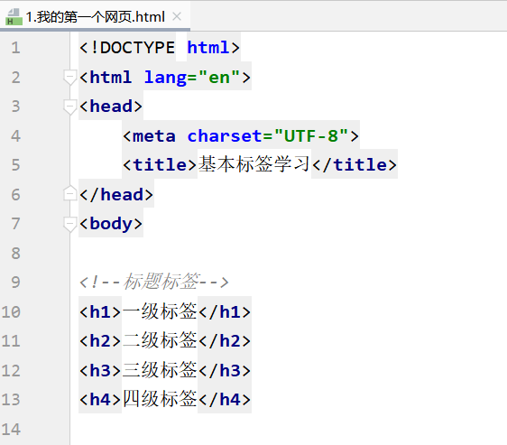


效果:


```c++
<!DOCTYPE html>
<html lang="en">
<head>
    <meta charset="UTF-8">
    <title>基本标签学习</title>
</head>
<body>

<!--标题标签-->
<h1>一级标签</h1>
<h2>二级标签</h2>
<h3>三级标签</h3>
<h4>四级标签</h4>

<!--段落标签
    优先占满网页的一行,不保留格式
-->  
<p>你还打算    上的讲话</p>

<!--换行标签(间距小)-->
你还打算  上的讲话<br/>

<!--水平线标签-->
<hr/>

<!--字体标签-->
粗体: <strong>i you</strong>
斜体: <em>i you</em>

<!--特殊符号-->

空格 空&nbsp;格
大于 &gt;
小于 &lt;
版权 &COPY;


</body>
</html>
```


**p标签内部文本不会保留格式:    但是</p>默认换行**


------------


## 行元素块元素


---------------------

# 图像标签

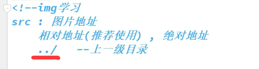


--------

例如:

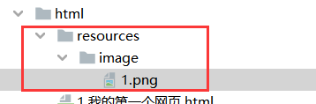


\

效果


代码

```c++
<!DOCTYPE html>
<html lang="en">
<head>
    <meta charset="UTF-8">
    <title>基本标签学习</title>
</head>
<body>


</body>
</html>
```


# 链接标签


```html
<!DOCTYPE html>
<html lang="en">
<head>
    <meta charset="UTF-8">
    <title>链接标签</title>
</head>
<body>

<a name="top">顶部</a>

<!--1. 页面间链接
    格式:  <a href="链接目标/">链接文本名称</a>
    只能取打开另一个页面,不会精确到某个位置
-->
<a href="1.我的第一个网页.html" >点击跳转到我的页面</a>
<!--在浏览器的新标签页打开-->
<a href="https://www.baidu.com" target="_blank">点击跳转到百度页面</a>
<!--可以放图标,该图标也可以链接到网页-->
<a href="https://www.digitalocean.com/community">The text you want to link
    
</a>


<!--2锚链接
    1. 需要一个标记   使用<name 标记>
    2. 跳转标记 #标记
    3. 可以在页面间跳转到另一个页面的相应位置,  --比如目录
-->
<<a href="#top">回到顶部</a>


<!--3.功能性标签
    邮箱链接 : mailto:
-->
<a href="mailto:1665834268@qq.com">点击来联系我</a>


</body>
</html>
```


#  列表

<!--有序列表     <!--无序列表     <!--定义列表

```html
<!DOCTYPE html>
<html lang="en">
<head>
    <meta charset="UTF-8">
    <title>列表</title>
</head>
<body>
<!--有序列表
    应用: 问答
-->
<ol>
<li>java</li>
<li>c++</li>
<li>python</li>
<li>取</li>
</ol>

<hr/>
    
<!--无序列表
    应用: 导航, 侧边栏
-->
<ul>
    <li>java</li>
    <li>c++</li>
    <li>python</li>
    <li>取</li>
</ul>

<!--定义列表
    dl: 标签
    dt: 列表名称
    dd: 列表内容
    应用: 网站底部
-->
<dl>
    <dt>学科</dt>
    <dd>java</dd>
    <dd>c++</dd>
    <dd>python</dd>
    <dd>取</dd>

    <dt>位置</dt>
    <dd>java</dd>
    <dd>c++</dd>
    <dd>python</dd>
    <dd>取</dd>
</dl>

</body>
</html>
```


定义列表最终应用:


# 表格


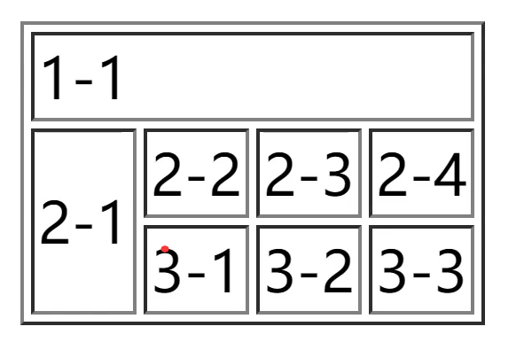


# 媒体

```c++
<!--视频-->
<video src=".MP4" controls></video>
<<!--背景音乐-->
<audio src="music/Michael Evenson-Notes in the Sky.mp3" id="aud" autoplay="autoplay"  controls="controls" loop="loop" preload="auto"</audio>
<!--背景音乐-->

```


# 页面结构分析


A.png)


# 表单


```c++
<!DOCTYPE html>
<html lang="en" xmlns="http://www.w3.org/1999/html" xmlns="http://www.w3.org/1999/html">
<head>
    <meta charset="UTF-8">
    <title>表单</title>
</head>
<body>

<!--表单
    action :表单提交的位置，可以是网站，也可以是一个请求处理地址
    method : post,get提交方式
        get方式提交：我们可以在url中看到我们提交的信息，不安全，高效
        post：比较安全，传输大文件.
-->
<form action="#" method="get">
    <!--placeholder 提示信息-->
    <p>名字: <input type="text" name="username" placeholder="请输入用户名"></p>
    <p>密码: <input type="password" name="password" id="password"></p>
    
    <!--单选框-->
    <p>性别：
        <input type="radio" name="sex" value="male" checked/>男
        <input type="radio" name="sex" value="falme">女
    </p>
    
    <!--多选框-->
    </p>爱好：
        <input type="checkbox" name="habby" value="shopping">购物
        <input type="checkbox" name="habby"  value="game">游戏
        <input type="checkbox" name="habby" value="study">学习
        <input type="checkbox" name="habby" value="study">敲代码
    </p>

    <!--文件域-->
    <p>上传文件:
        <input type="file" name="files" id="files">
    </p>

<!--    隐藏域：<input type="hidden" name="hidden" value="aaaa"><br>-->
    取色器：<input type="color" name="color" id="color"><br>
<!--    生日：<input type="date" name="date" id="date"><br>-->
    生日：<input type="datetime-local" name="birthday" id="birthday"><br/>
    
    <!--pattern 写正则表达式 网上搜  https://www.jb51.net/tools/regexsc.htm -->
    邮箱：<input type="email" name="email" id="email" pattern="/^([a-z0-9_\.-]+)@([\da-z\.-]+)\.([a-z\.]{2,6})$/
/^[a-z\d]+(\.[a-z\d]+)*@([\da-z](-[\da-z])?)+(\.{1,2}[a-z]+)+$/或\w+([-+.]\w+)*@\w+([-.]\w+)*\.\w+([-.]\w+)*"><br/>
    年龄：<input type="number" name="age" id="age" min="1" max="150"><br>

    <!--滑块-->
    <p>音量:
        <input type="range" name="video">
    </p>

    <!--搜索框--> <!--+ 增加鼠标可用性
        点击文本会自动跳转到id的位置
    -->
    <p>
        <label for="search">搜索:</label>
        <input type="search" name="search" id="search">
    </p>

    <!--下拉框-->
    <p>省份：
        <select name="provinces" id="provinces">
        <option value="">请选择</option>
        <option value="1">北京</option>
        <option value="2">上海</option>
        <option value="3">西安</option>
        </select>
    </p>
    <!--文本域-->
    </p>自我描述:<br>
        <textarea name="des" id="des" cols="30" rows="10" placeholder="文本内容"></textarea>
    </p>

    <!--按钮
               input type= "button"普通按钮
               input type= "image" 图像按钮
               input type= "submit"提交按钮
               input type="reset" 重置
           <p>按钮:
               <input type="button" name="btn1" value="Mtk K"><input type="image" src=". ./resources/ image/1.jpg"></p>
           <p>
           <input type="reset" value="清空表单"></p>
       -->
    <p>按钮:
        <input type="submit" value="提交">
        <input type="reset" value="清空表单">
        <input type="image" src="./img/regbtn.jpg" alt="提交图片">
    </p>

</form>

</body>
</html>
```


**增加鼠标可读性**

```html
					
<!--表单项标签-->
<form action="#" method="get">
    <label for="username">
    用户名：    </label>
            <input type="text" name="username" id="username" placeholder="请输入用户名"><br>
    <label for="password">
    密码：    </label>
            <input type="password" name="password" id="password"><br>
    性别：     <input type="radio" name="gender"  value="male" checked>男
            <input type="radio" name="gender" value="falme">女<br>
    爱好：     <input type="checkbox" name="habby" value="shopping">购物
            <input type="checkbox" name="habby"  value="game">游戏
            <input type="checkbox" name="habby" value="study">学习<br>
    上传图片：<input type="file" name="myimg" id="myimg"><br>
    隐藏域：<input type="hidden" name="hidden" value="aaaa"><br>
    取色器：<input type="color" name="color" id="color"><br>
    生日：<input type="date" name="date" id="date"><br>
    生日：<input type="datetime-local" name="birthday" id="birthday"><br>
    邮箱：<input type="email" name="email" id="email"><br>
    年龄：<input type="number" name="age" id="age"><br>
    省份：<select name="provinces" id="provinces">
            <option value="">请选择</option>
            <option value="1">北京</option>
            <option value="2">上海</option>
            <option value="3">西安</option>
        </select><br>
    自我描述：<br><textarea name="des" id="des" cols="30" rows="10"></textarea><br>
    <input type="submit" value="提交">
    <input type="button" value="按钮提交">
    <input type="image" src="./img/regbtn.jpg" alt="提交图片">
</form>
<!--表单项标签-->
```


-------------


# ----css----


 index.html

```
<!DOCTYPE html>
<html lang="en">
<head>
    <meta charset="UTF-8">
    <title>Title</title>
    <!--规范通过<style>可以编写css的代码
    语法:
    选择器{
        声明1;
        声明2;
    }
    -->
    <link rel="stylesheet" href="style.css">

</head>
<body>
<h1>第一</h1>
</body>
</html>
```

style.css

```
h1{
    color: red;
}
```

#  导入css的方法

```html
<link rel="stylesheet" href="style.css">   // stylesheet固定的
```


# 选择器

## 基本选择器


```html
<!DOCTYPE html>
<html lang="en">
<head>
    <meta charset="UTF-8">
    <title>Title</title>
    <!--规范通过<style>可以编写css的代码
    语法:
    选择器{
        声明1;
        声明2;
    }
    -->
    <link rel="stylesheet" href="style.css">

</head>
<body>

<!--类选择器-->
<!--
    类选择器可以,多标签归类. 可以复用
-->
<h1 class="head1">第一</h1>
<h1 class="head2">第一</h1>
<p class="head1">第一</p>

<!--标签选择器-->
<p class="head1">dsfahdhs 啊的苏格兰和</p>

<!--id选择器-->
<!--id必须全局唯一
     不遵循就近原则
-->
<h1 id="id1">第一</h1>

</body>
</html>
```


CSS

```HTML
/*类选择器*/
.head1{
    color: #d42020;
    background: aquamarine;
}
.head2{
    color: #5cc718;
    background: #c1972c;
}
/*标签选择器*/
p{
    font-size: 10px;
}

/*id选择器*/
#id1{
    color:red;
}
```


**优先级  id>class>标签**


## 层次选择器


## 结构伪类选择器


## 属性选择器(常用)

**class + id 连用**

 

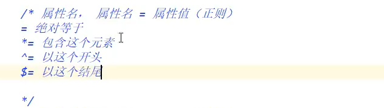

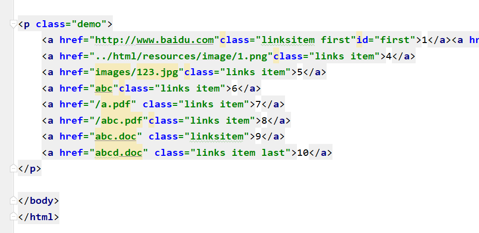


-----------


#  美化网页元素


## 1修改字体


```html
<!DOCTYPE html>
<html lang="en">
<head>
    <meta charset="UTF-8">
    <title>字体样式</title>
    
<!--    font->family : 字体
        font->size : 字体大小
       	font->weight : 字体粗细
       	color : 字体颜色
-->
    <style>
        body{
            font-family: 楷体;
            color: #2cce9f;
        }
        h1{
            font-size: 50px;
        }
        .p1{
            font-weight: bold;
        }
    </style>
</head>
<body>

<h1>故事介绍</h1>
<p class="p1">
    这个世界名为元泱境界，脉（本质为振动）是构成万物的基础。每隔333年，会有一个神秘而强大的异常生物重生，它就是魁拔！魁拔的每一次出现，都会给元泱境界带来巨大的灾难！即便是天界的神族，也在劫难逃。在天地两界各种力量的全力打击下，魁拔一次次被消灭，但又总是按333年的周期重新出现。魁拔纪元1664年，天神经过精确测算后，在魁拔苏醒前一刻对其进行毁灭性打击。但谁都没有想到，由于一个差错导致新一代魁拔成功地逃脱了致命一击。很快，天界魁拔司和地界神圣联盟均探测到了魁拔依然生还的迹象。因此，找到魁拔，彻底消灭魁拔，再一次成了各地热血勇士的终极目标。
</p>
<p>
    在偏远的兽国窝窝乡，蛮大人和蛮吉每天为取得象征成功和光荣的妖侠纹耀而刻苦修炼，却把他们生活的村庄搅得鸡犬不宁。村民们绞尽脑汁把他们赶走。一天，消灭魁拔的征兵令突然传到窝窝乡，村长趁机怂恿蛮大人和蛮吉从军参战。然而，在这个一切都凭纹耀说话的世界，仅凭蛮大人现有的一块冒牌纹耀，不要说参军，就连住店的资格都没有。受尽歧视的蛮吉和蛮大人决定，混上那艘即将启程去消灭魁拔的巨型战舰，直接挑战魁拔，用热血换取至高的荣誉。 [1]
</p>

</body>
</html>
```


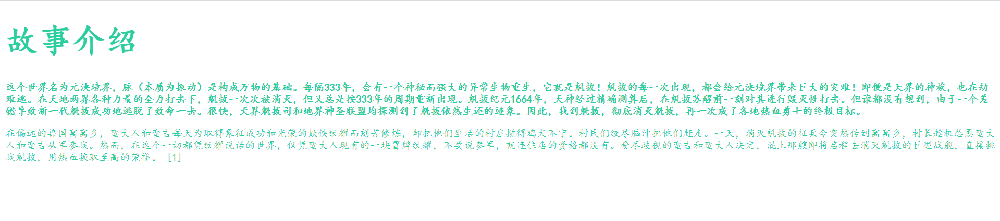


## 2文本样式


```html
<!DOCTYPE html>
<html lang="en">
<head>
  <meta charset="UTF-8">
  <title>文本样式</title>
  <!--   颜色:
            单词
            RGB 0-F
            RGBA A: 0-1

        text-align : 排版, 居中
        text-indent : 2em; 段落首行缩进

        行高:
           和块的高度一致, 就可以上下居中   height  == line-height
  -->
  <style>
     h1{
       color: rgba(0, 255, 255, 0.9);
       text-align: center;
     }
     .p1{
       text-indent: 2em;
     }
     .p2{
       background: #2cce9f;
       height: 300px;
       line-height: 300px;
     }

  </style>
</head>
<body>

<h1>故事介绍</h1>
<p class="p1">
  这个世界名为元泱境界，脉（本质为振动）是构成万物的基础。每隔333年，会有一个神秘而强大的异常生物重生，它就是魁拔！魁拔的每一次出现，都会给元泱境界带来巨大的灾难！即便是天界的神族，也在劫难逃。在天地两界各种力量的全力打击下，魁拔一次次被消灭，但又总是按333年的周期重新出现。魁拔纪元1664年，天神经过精确测算后，在魁拔苏醒前一刻对其进行毁灭性打击。但谁都没有想到，由于一个差错导致新一代魁拔成功地逃脱了致命一击。很快，天界魁拔司和地界神圣联盟均探测到了魁拔依然生还的迹象。因此，找到魁拔，彻底消灭魁拔，再一次成了各地热血勇士的终极目标。
</p>
<p class="p2">
  在偏远的兽国窝窝乡，蛮大人和蛮吉每天为取得象征成功和光荣的妖侠纹耀而刻苦修炼，却把他们生活的村庄搅得鸡犬不宁。村民们绞尽脑汁把他们赶走。一天，消灭魁拔的征兵令突然传到窝窝乡，村长趁机怂恿蛮大人和蛮吉从军参战。然而，在这个一切都凭纹耀说话的世界，仅凭蛮大人现有的一块冒牌纹耀，不要说参军，就连住店的资格都没有。受尽歧视的蛮吉和蛮大人决定，混上那艘即将启程去消灭魁拔的巨型战舰，直接挑战魁拔，用热血换取至高的荣誉。 [1]
</p>

<p class="l1">123</p>
<p class="l2">123</p>
<p class="l3">123</p>
</body>
</html>
```


**text-decoration 下划线**


---------


## 3超链接伪类


```html
<!DOCTYPE html>
<html lang="en">
<head>
    <meta charset="UTF-8">
    <title>Title</title>
    <style>
        /*默认的颜色*/
        a{
            text-decoration: none;
            color: #c1972c;
        }
        /*鼠标悬浮颜色*/
        a:hover{
            color: red;
        }
        /*鼠标按住未释放的状态*/
        /*a:active{*/
        /*    color: #2cce9f;*/
        /*}*/
        /*a:visited{*/
        /*    color: blue;*/
        /*}*/

        #price{
            /*阴影  阴影颜色 水平偏移 垂直偏移 阴影半径 */
            text-shadow: blue 10px 10px 1px;
        }
    </style>
</head>
<body>
<a href="#">
    
</a>
<p>
    <a href="">时间简史</a>
</p>
<p>
    <a href="">作者: 规矩</a>
</p>
<p id="price">
    $99
</p>

</body>
</html>
```


### 图片操作


## 4列表样式练习

```html
<!DOCTYPE html>
<html>
<head lang="en">
  <meta charset="UTF-8">
  <title>列表样式</title>
  <link href="../css/style.css" rel="stylesheet" type="text/css"/>
</head>
<body>
<h2 class="title">全部商品分类</h2>
<ul>
  <li><a href="#">图书</a>&nbsp;&nbsp;<a href="#">音像</a>&nbsp;&nbsp;<a href="#">数字商品</a></li>
  <li><a href="#">家用电器</a>&nbsp;&nbsp;<a href="#">手机</a>&nbsp;&nbsp;<a href="#">数码</a></li>
  <li><a href="#">电脑</a>&nbsp;&nbsp;<a href="#">办公</a></li>
  <li><a href="#">家居</a>&nbsp;&nbsp;<a href="#">家装</a>&nbsp;&nbsp;<a href="#">厨具</a></li>
  <li><a href="#">服饰鞋帽</a>&nbsp;&nbsp;<a href="#">个护化妆</a></li>
  <li><a href="#">礼品箱包</a>&nbsp;&nbsp;<a href="#">钟表</a>&nbsp;&nbsp;<a href="#">珠宝</a></li>
  <li><a href="#">食品饮料</a>&nbsp;&nbsp;<a href="#">保健食品</a></li>
  <li><a href="#">彩票</a>&nbsp;&nbsp;<a href="#">旅行</a>&nbsp;&nbsp;<a href="#">充值</a>&nbsp;&nbsp;<a href="#">票务</a></li>
</ul>
</body>
</html>
```


```html
.title{
    font-size: 18px;
    font-weight: bold;
    text-indent: 1em;
    line-height: 30px;
    background: red;
}

ul li{
    height: 30px;
    list-style: none;
}

ul {
    background: antiquewhite;
}
a{
    text-decoration: none;
    font-size: 14px;
    font-weight: bold;
    color: #000;
}

a:hover{
    color: orange;
    text-decoration: underline;
}


```


改进:


```html
<!DOCTYPE html>
<html>
<head lang="en">
  <meta charset="UTF-8">
  <title>列表样式</title>
  <link href="../css/style.css" rel="stylesheet" type="text/css"/>
</head>
<body>
<div id="nav>   <!--新加的-->
  <h2 class="title">全部商品分类</h2>
  <ul>
    <li><a href="#">图书</a>&nbsp;&nbsp;<a href="#">音像</a>&nbsp;&nbsp;<a href="#">数字商品</a></li>
    <li><a href="#">家用电器</a>&nbsp;&nbsp;<a href="#">手机</a>&nbsp;&nbsp;<a href="#">数码</a></li>
    <li><a href="#">电脑</a>&nbsp;&nbsp;<a href="#">办公</a></li>
    <li><a href="#">家居</a>&nbsp;&nbsp;<a href="#">家装</a>&nbsp;&nbsp;<a href="#">厨具</a></li>
    <li><a href="#">服饰鞋帽</a>&nbsp;&nbsp;<a href="#">个护化妆</a></li>
    <li><a href="#">礼品箱包</a>&nbsp;&nbsp;<a href="#">钟表</a>&nbsp;&nbsp;<a href="#">珠宝</a></li>
    <li><a href="#">食品饮料</a>&nbsp;&nbsp;<a href="#">保健食品</a></li>
    <li><a href="#">彩票</a>&nbsp;&nbsp;<a href="#">旅行</a>&nbsp;&nbsp;<a href="#">充值</a>&nbsp;&nbsp;<a href="#">票务</a></li>
  </ul>
</div>

</body>
</html>
```


```css
.title{
    font-size: 18px;
    font-weight: bold;
    text-indent: 1em;
    line-height: 30px;
    background: red;
}

#nav{
    width: 300px;   // 一般结合浏览器调整
}

ul li{
    height: 30px;
    list-style: none;
}

ul {
    background: antiquewhite;
}
a{
    text-decoration: none;
    font-size: 14px;
    font-weight: bold;
    color: #000;
}

a:hover{
    color: orange;
    text-decoration: underline;
}


```

**调整合适位置**


**效果:**

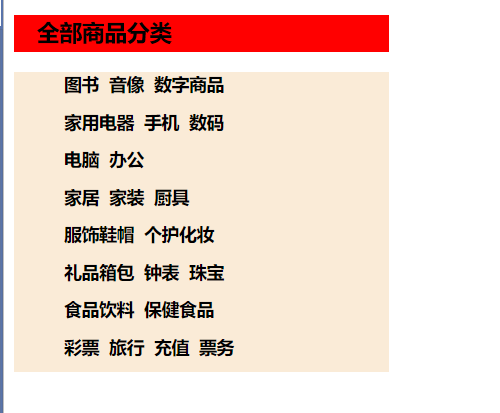


## 5.背景图像应用及渐变

### 背景图像

```c++
<!DOCTYPE html>
<html lang="en">
<head>
    <meta charset="UTF-8">
    <title>Title</title>
    <style>
        div {
            width: 1000px;
            height: 700px;
            /*边框*/
            border: 1px solid red;
            /*默认全部平铺*/
            background-image: url("../html/resources/image/a.png");
        }

        .div1{
            /*不平铺*/
            background-repeat: no-repeat;
        }
        .div2{
            /*垂直平铺*/
            background-repeat: repeat-y;
        }
    </style>
</head>
<body>

<div class="div1"></div>
<div class="div2"></div>
<div class="div3"></div>

</body>
</html>
```


### 渐变

```html

<!DOCTYPE html>
<html lang="en">
<head>
    <meta charset="UTF-8">
    <title>Title</title>
  <style>
      body{
          background-color: #0093E9;
          background-image: linear-gradient(191deg, #0093E9 0%, #80D0C7 100%);
      }
  </style>
</head>
<body>

</body>
</html>
```


网站

[Grabient](https://www.grabient.com/)


## 6盒子模型和边框

### 盒子模型


**margin外边距**

**padding 内边距**

**boeder 边框**


### 边框


```html
<!DOCTYPE html>
<html lang="en">
<head>
    <meta charset="UTF-8">
    <title>登录</title>

    <style>
        body{
            /*body总有一个默认的外边距  margin: 0; 下面是规范*/
            margin: 0;
            padding: 0;
            text-decoration: none;
        }

        #box{
            width: 300px;
            /*粗细 样式 颜色*/
            border: 1px solid red;
        }

        form{
            background: #2cce9f;
        }
        div>input{
            border: 3px solid black;
        }
        h2{
            margin-top: 0px;
            margin-bottom: 0px;
        }


    </style>

</head>
<body>

<div id="box">
  <h2>会员登陆</h2>
  <form action="#">
        <div>
            <span>用户名:</span>
            <input type="text" name="" >
        </div>
        <div>
            <span>密码:</span>
            <input type="text" name="" id="">
        </div>
        <div>
            <span>邮箱:</span>
            <input type="text" name="" id="">
        </div>
    </form>
</div>

</body>
</html>
```


## 内外边距


**妙用居中元素**

​		+ 前提有块元素


```html
<!DOCTYPE html>
<html lang="en">
<head>
    <meta charset="UTF-8">
    <title>登录</title>

    <style>
        body{
            /*body总有一个默认的外边距  margin: 0; 下面是规范*/
            padding: 0;
            text-decoration: none;
            margin: 0;
        }

        #box{
            width: 300px;
            /*粗细 样式 颜色*/
            border: 1px solid red;
            margin: 0 auto;
        }

        form{
            background: #2cce9f;
        }
        div>input{
            border: 3px solid black;
        }
        h2{
            margin-top: 0px;
            margin-bottom: 0px;
        }


    </style>

</head>
<body>

<div id="box">
  <h2>会员登陆</h2>
  <form action="#">
        <div>
            <span>用户名:</span>
            <input type="text" name="" >
        </div>
        <div>
            <span>密码:</span>
            <input type="text" name="" id="">
        </div>
        <div>
            <span>邮箱:</span>
            <input type="text" name="" id="">
        </div>
    </form>
</div>

</body>
</html>
```


居中


### 盒子的计算方式:


## 圆角边框


```html
<!DOCTYPE html>
<html lang="en">
<head>
    <meta charset="UTF-8">
    <title>圆角边框</title>
  <style>
    /*左上 右上 右下 左下   顺时针
        圆圈
    */
    div{
        width: 50px;
        height: 50px;
        margin: 30px;
        border: 10px solid red;
        border-radius: 50px 0px 0px 0px;
    }

    img{
        border-radius: 25px;
    }

  </style>
</head>
<body>

<div>

</div>


</body>
</html>
```


## 盒子阴影


```
  div{
        width: 50px;
        height: 50px;
        margin: 30px;
        border: 10px solid red;
        border-radius: 50px 0px 0px 0px;
        /*盒子阴影*/
        box-shadow: 10px 10px 1px yellow;
    }
```


## display和浮动

  

> 前言 

**标准文本流**


-------


### 块元素和行元素


块级元素：独占一行

```
h1~h6     P     div 列表...
```

行内元素：不独占一行

```
1   span   a  img     strong....
```

**行内元素 可以被包含在 块级元素中，反之，则不可以~**


**例子:**


**a标签的行元素**


**变成块元素**

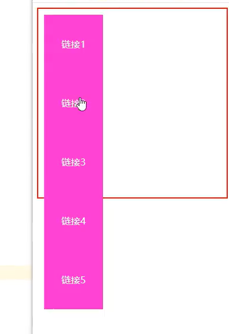


---


如 :

```
<!DOCTYPE html>
<html lang="en">
<head>
    <meta charset="UTF-8">
    <title>Title</title>

    <style>
        div{
            width: 100px;
            height: 100px;
            border: 1px solid red;
        }

        span{
            width: 100px;
            height: 100px;
            border: 1px solid red;
        }
    </style>


</head>
<body>

<div>
    div块元素
</div>

<span>
    行类元素, 文字多少就占多少
</span>

</body>
</html>
```


 **行类元素, 文字多少就占多少, 可以设置高度**


### display

---------

**使用display**


### float


### 对比


--------


## 父级边框塌陷问题

clear

```
clear: right;右侧不允许有浮动元素
clear: left;左侧不允许有浮动元素
clear: both;两侧不允许有浮动元素
clear: none;
```


解决方案

### 1.增加父级高度

```
#father{
	border : lpx #000 solod
	height : 800px
}
```


### 2.增加一个空的div标签

**标准解法:**


效果


### 3.overflow

下拉的场景不能用,,   还有很多副作用

```
在父级元素中增加一个  overflow: hidden
```


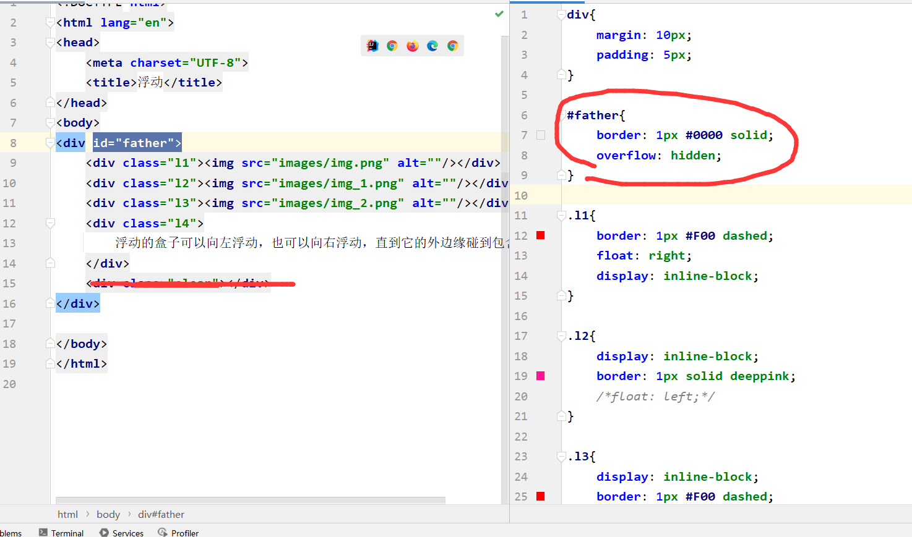


### 4.添加一个伪类 (最好的)

相当于自动添加2

```css
#father : after{
	content: '';
	display: block;
	clear: both;
}
```


------------


## 定位的使用


### 相对定位


```html
<!DOCTYPE html>
<html lang="en">
<head>
    <meta charset="UTF-8">
    <title>定位</title>
    <style>
        div {
            margin: 10px;
            padding: 5px;
            font-size: 12px;
            line-height: 25px;
        }
        #first{
            background-color: #d42020;
            border: 1px solid #666;
            /*相对定位  相对于原来的位置     上下左右*/
            position: relative;
            /*向上*/
            top: -20px;
            /*向下*/
            bottom: -10px;
            /*向右*/
            left: 20px;
            /*向左*/
            right: 30px;

        }

        #second{
            background-color: #5cc718;
            border: 1px solid #7f0606;
        }

        #third{
            background-color: #0093E9;
            border: 1px solid #11cd96;
        }

    </style>
</head>
<body>

<div id="father">
    <div id="first">
        第一个盒子
    </div>
    <div id="second" >
        第二个盒子
    </div>
    <div id="third">
        第三个盒子
    </div>
</div>

</body>
</html>
```


### 方块定位例题

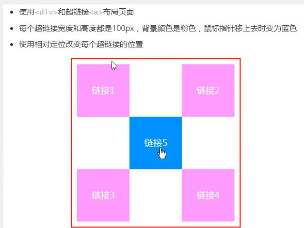


```html
<!DOCTYPE html>
<html lang="en">
<head>
    <meta charset="UTF-8">
    <title>方块定位</title>

    <style>
        #box{
            width: 300px;
            height: 300px;
            border: 1px solid red;
            padding: 10px;
        }

        a{
            width: 100px;
            height: 100px;
            text-decoration: none;
            background-color: orange;
            line-height: 100px;
            text-align: center;
            color: #5cc718;
            display: block;
        }

        a:hover{
            background-color: #d42020;
        }

        .a2,.a4{
            position: relative;
            left: 200px;
            top: -100px;
        }

        .a5{
            position: relative;
            left: 100px;
            top: -300px;
        }


    </style>

</head>
<body>

<div id="box">
    <a class="a1" href="#">链接1</a>
    <a class="a2" href="#">链接2</a>
    <a class="a3" href="#">链接3</a>
    <a class="a4" href="#">链接4</a>
    <a class="a5" href="#">链接5</a>
</div>


</body>
</html>
```


### 绝对定位

```
position: absolute;
```

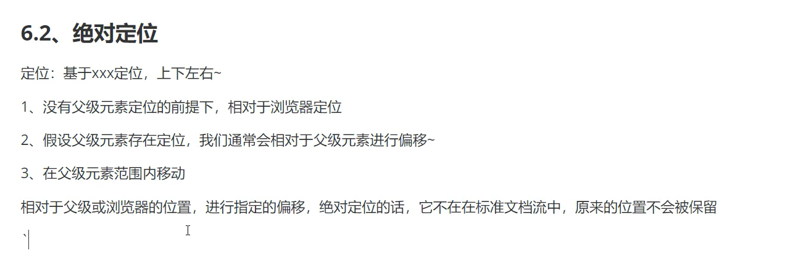


### 固定定位

**页面移动也不变**


```html
<!DOCTYPE html>
<html lang="en">
<head>
    <meta charset="UTF-8">
    <title>固定定位</title>

    <style>
      div:nth-of-type(1){
          /*绝对定位*/
        width: 100px;
        height: 100px;
        background-color: red;
        position: absolute;
        right: 0;
        bottom: 0;
      }

      /*相对定位*/
      div:nth-of-type(2){
          width: 50px;
          height: 50px;
          background-color: orange;
          position: fixed;
          right: 0;
          bottom: 0;
      }
    </style>

</head>
<body>

<div>div1</div>
<div>div2</div>
</body>
</html>
```


### z-index及透明度

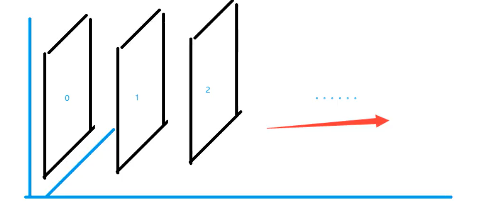


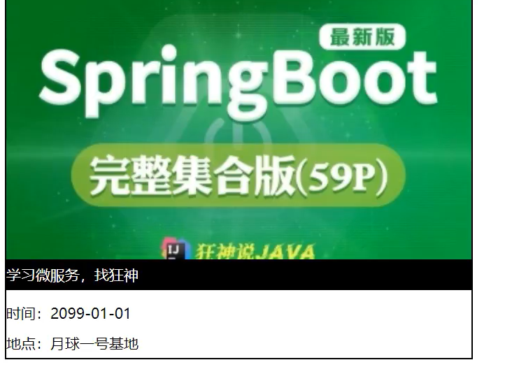

```

```

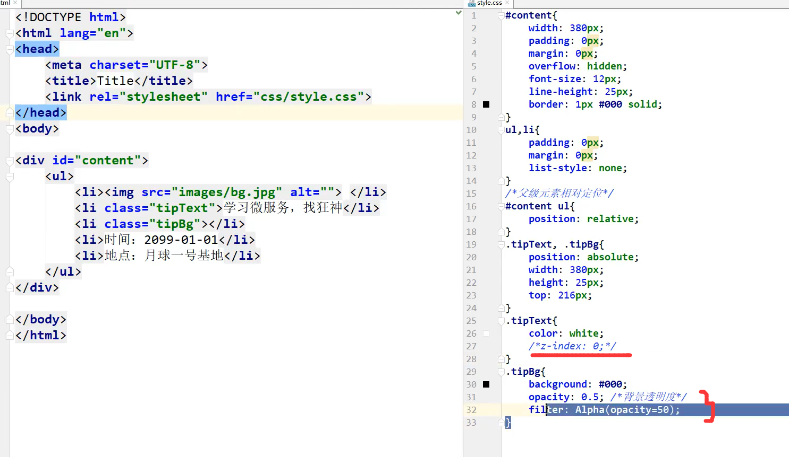


## 动画


网站

