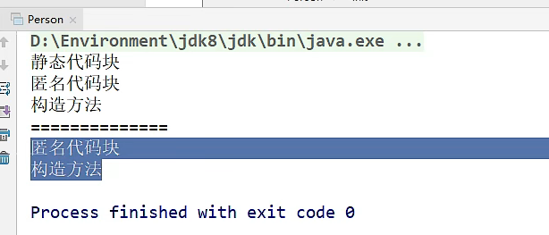
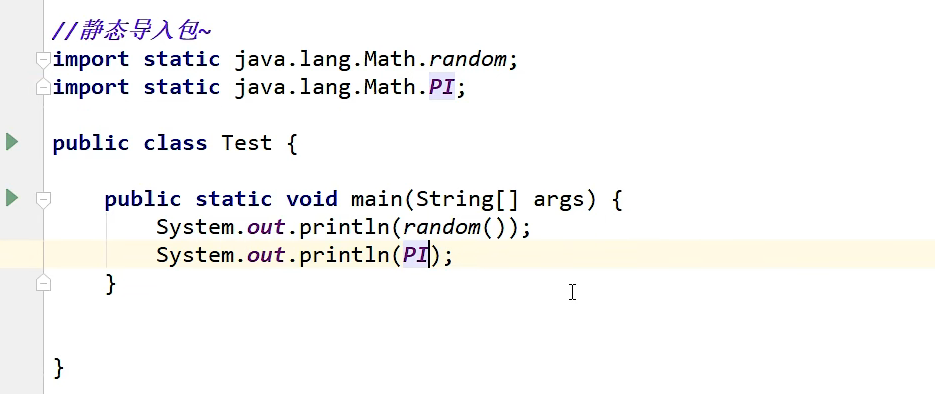

# 基础

## 代码结构


###  包机制


## 注释

多行注释 : 注释一段文字   /*   */

单行注释:    // 


### 文档注释: 

```
/**   
*@Description 
*@
*/
```


命令行

```cmd
javadoc -encoding UTF-8 -charset UTF-8 文件名
```


## 标识符


## 数据类型


### 基本数据类型

==**有默认值**==


### 整数扩展


### 浮点数扩展


### 字符扩展


## 类型转换


### 重要


```java
public class hello {
    //输出
    public static void main(String[] args){
        System.out.println("=================");
        char c = 'a';
        int d = c+1;
        System.out.println(d);  // 显示转换   98
        System.out.println((char)d);  // 高到低  隐式转换  b
    }
}
```


### 已经出现问题


## 变量


### 要求

+ **只有常量是全大写有下划线**
+ **其他全部遵守驼峰原则**
+ **类是首字母大写再遵守驼峰原则**


### 变量作用域


###  核心

```java
public class variable {

    // 类变量: static
    static double salary = 2000;

    //属性：变量

    //实例变量：从属于对象；如果不自行初始化，这个类型的默认值 0 0.0
    //布尔值：默认是false
    //除了基本类型，其余的默认值都是null；
    String name;
    int age;

    //main方法
    public static void main(String[] args) {

        //局部变量；
        //必须声明和初始化值
        int i = 10;
        System.out.println(i);;

        //实例变量:
        // 变量类型 变量名字 = new variable()；
        variable var = new variable();
        System.out.println(var.age);
        System.out.println(var.name);

        //类变量 static
        System.out.println(salary);
    }

}
```


## 常量

修饰符  final

```java
final double pi = 3.14;
```

final之后是不能被继承的

## 运算符


### ** 字符串连接符 + **

```c++
// 字符串连接符 + , String
int a = 10;
int b = 30;
System.out.println("" + a + b);   // 会进行拼接
System.out.println(a + b + "");   // 不会进行拼接
```


### 三元运算符

**m  =  x < y ? x : y**


##  输入

## 使用方法


##  单个输入


## 整行输入


## 读取整数,小数


```c++
package com.jindao;

import java.util.Scanner;

public class Scan {
    public static void main(String[] args) {

        Scanner scanner = new Scanner(System.in);
        double sum = 0;
        int count = 0;
        System.out.println("请输入数字(输入不是数字退出)");
        while (scanner.hasNextDouble())
        {
            double x = scanner.nextDouble();
            count++;
            sum+= x;
        }
        System.out.println(count + "个数的和为" + sum);
        System.out.println(count + "个数的平均值" + sum/count);
    }
}
```


##  顺序结构


选择结构


 

## 循环结构


## for循环


**100.for直接生成**

**for (;;;)  --- > 死循环**


###  99乘法表

```java
package com.jindao;

public class Fordemo02 {
    public static void main(String[] args) {
        for (int i = 1; i <= 9; i++) {
            for (int j = 1; j <= i; j++) {
                System.out.print(i + "*" + j + "=" + i*j + "\t");
            }
            System.out.println();
        }
    }
}
```


## break和continue


## 方法


+ **修饰符 返回类型 方法名(参数)** 

### 方法的定义


### 方法的调用

[W_UW}TU50$C32.png) 

####  静态方法


#### 非静态方法


#### 两者区别


### 方法的重载


## 命令行传参


## 可变参数


例子:


递归


## 数组


==**int[]    表示数组类型**==


### 内存分析


### 三种初始化方式


+ **动态初始化有默认的值   int 对应 0  **


**数组的基本特点**


###  数组使用


### 二维数组


**图示:**


## Arrays类


## 冒泡排序


###  代码

```java
package com.jindao;

import java.util.Arrays;

public class ArrayDemo03 {
    public static void main(String[] args) {
        int[] array = {1, 4, 5, 6, 72, 2, 2, 2, 25, 6, 7};
        int[] sort = sort(array);
        System.out.println(Arrays.toString(sort));
    }
    
    public static int[] sort(int[] array) { 
        for (int i = 0; i < array.length - 1; i++) {    // 交换的次数
            boolean flag = false;
            for (int j = 0; j < array.length-1-i; j++) {
                if (array[j+1] >= array[j]) {
                    array[j] ^= array[j+1];
                    array[j+1] ^= array[j];
                    array[j] ^= array[j+1];
                    flag = true;
                }
            }
        }
        if (flag = false)
            break;
        
        return array;
    }
}

```

----------------


## 稀疏数组


```java
package com.jindao;

public class ArrayDemo04 {
    public static void main(String[] args) {
        int[][] array1 = new int[11][11];
        array1[1][2] = 1;
        array1[2][3] = 2;
        System.out.println("输出原始数组:");
        for (int[] ints : array1) {
            for(int n : ints) {
                System.out.print(n+"\t");
            }
            System.out.println();
        }

        // 稀疏数组
        //1.获取有效个数
        int sum = 0;
        for (int i = 0; i < 11; i++) {
            for (int i1 = 0; i1 < 11; i1++) {
                if (array1[i][i1] != 0)
                    sum++;
            }
        }
        System.out.println("有效个数: " + sum);

        //2.创建稀疏数组
        int[][] array2 = new int[sum + 1][3];
        // 初始化, 行列非零值数量
        array2[0][0] = 11;
        array2[0][1] = 11;
        array2[0][2] = sum;
        //存非零值
        int count = 0;
        for (int i = 0; i < array1.length; i++) {
            for (int i1 = 0; i1 < array1[i].length; i1++) {
                if (array1[i][i1] != 0) {
                    count++;
                    array2[count][0] = i;
                    array2[count][1] = i1;
                    array2[count][2] = array1[1][i1];
                }
            }
        }

        // 输出稀疏数组
        System.out.println("稀疏数组");
        for (int i = 0; i < array2.length; i++) {
            System.out.println(array2[i][0] + "\t"
                    + array2[i][1] + "\t"
                    + array2[i][2] + "\t");
        }

        // 还原稀疏数组
        //1.读取
        int[][] array3 = new int[array2[0][0]][array2[0][1]];
        //2.还原
        for (int i = 1; i < array2.length; i++) {
            array3[array2[i][0]][array2[i][1]] = array2[i][2];
        }
        //3.打印
        for (int[] ints : array3) {
            for(int n : ints) {
                System.out.print(n+"\t");
            }
            System.out.println();
        }
    }
}

```


-----------------


# 面向对象

## 类与对象创建


## 构造器


快捷键

**alt+insert----->可以快捷生成**


**this.属性 = 进行初始化**

-----------


## 创建对象内存分析


-------------------------

## 小结


## 封装


DM_X.png)


## 继承


### super


###  方法的重写


**不能重写的**


--------------


## 多态

#### 基础


---------


### instanceof和类型转换


 x  instanof y      // 


5EL@EH99C.png)


## static

1. **静态代码块**





2. **静态导入包**




3. **静态方法**


## 抽象类


## 接口

**利用接口实现多继承**


## 内部类

### 1.正常的


### **2. 局部内部类**


### 3. 没有名字的初始化类

**可以简单的使用方法**


## 异常

### 基础


###  捕获抛出异常

**代码块的捕获异常**


自动填写代码


**抛出方法的异常**


###  自定义异常类


**test ; **


