# 1、基本概念

## 1.1 基本概念

1. 静态web：html，css（提供给所有人看的数据，始终不会发生变化）
2. 动态web：Servlet/JSP，ASP，PHP  (淘宝等几乎所有的网站)
   （提供给所有人看的数据，始终会发生变化，每个人在不同时间，不同地方看到的都不同）

## 1.2 web应用程序

web应用程序：可以提供浏览器访问的程序

- a.html、b.html等多个web资源，这些web资源可以被外界访问，对外界提供服务。
- 你们能访问到的任何一个页面或者资源，都存在于这个世界的某一个角落的计算机上。
- URL：统一资源定位符。
- 这个统一的web资源会被放在同一个文件夹下，web应用程序—>Tomcat：服务器。
- **web应用程序编写完毕后，若想提供给外界访问：需要一个服务器来统一管理。**
- 一个web应用由多部分组成 (静态web，动态web)
  + html，SS，is
  + isp，servlet
  + Java程序
  + jar包
  + 配置文件 (Properties)

## 1.3 静态web

*.htm，*.html，这些都是网页的后缀，如果服务器上一直存在这些东西，我们就可以直接进行读取。

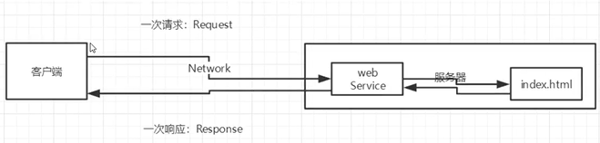

静态web存在的缺点:

+ Web页面无法动态更新，所有用户看到都是同一个页面
  轮播图，点击特效:伪动态
  +  JavaScript [实际开发中]
  + VBScript

+ **==它无法和数据库交互(数据无法持久化，用户无法交互)==**

### 1.4 动态web

页面会动态展示：Web的页面展示的效果因人而异。
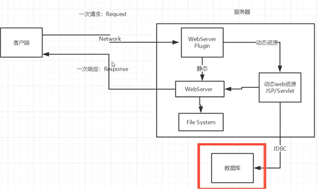

缺点:

+ 加入服务器的动态web资源出现了错误，我们需要重新编写我们的后台程序,重新发布
+ 停机维护

优点:

+ Web页面可以动态更新，所有用户看到都不是同一个页面
+ 它可以与数据库交互（数据无法持久化，用户无法交互

#  2、web服务器

## 2.1 web服务器技术

+ ASP

+ PHP

+ **JSP/Servlet :**

  + B/S：浏览和服务器

  + C/S：客户端和服务器

    Sun公司主推的B/S架构

    基于ava语言的(所有的大公司，或者一些开源的组件，都是用Java写的

    可以承载三高问题带来的影响

    语法像ASP，ASP-->|SP，加强市场强度

**服务器是一种被动的操作，用来处理用户的一些请求和给用户一些响应信息。**

IIS:   微软的服务器

tomcat:  Tomcat服务器是一个免费的开放源代码的Web应用服务器，属于轻量级应用服务器，在中小型系统和并发访问用户不是很多的场合下被普遍使用，是开发和调试JSP程序的首选。
对于一个初学者来说，可以这样认为，当在一台机器上配置好Apache服务器，可利用它响应HTML（标准通用标记语言下的一个应用）页面的访问请求。实际上Tomcat是Apache服务器的扩展，但运行时它是独立运行的，所以当你运行tomcat时，它实际上作为一个与Apache 独立的进程单独运行的。

## 2.2 **常见的web的服务器**

- Apache、
- Nginx、
- IIS、
- WebLogic、
- WebSphere、
- **Tomcat**

# 3、Tomcat

## 3.1 安装tomcat

tomcat官网：http://tomcat.apache.org/

1、选择合适在的压缩包


2、下载压缩包并解压

## 3.2 Tomcat启动和配置


启动。关闭Tomcat


访问测试：http://localhost:8080/


可能遇到的问题：

1. Java环境变量没有配置
2. 闪退问题：需要配置兼容性
3. 乱码问题：配置文件中设置

## 3.3 配置

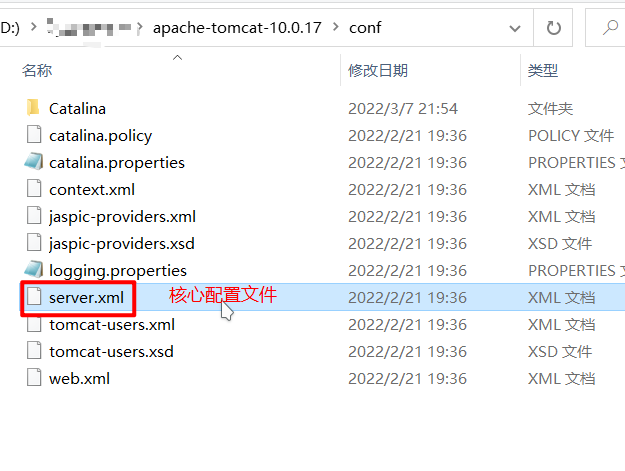

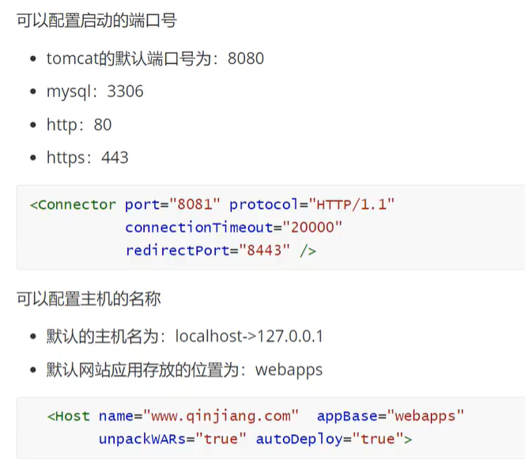
**网站是如何访问的:**

1. 输入一个域名，回车

2. 检查本机的C:Windows\System32\drivers\etc\hosts配置文件下有没有这个域名映射
   有：直接返回对应的ip地址，这个地址中，有我们需要访问的web程序，可以直接访问。

   没有：去DNS服务器找，找到的话就返回，找不到就返回找不到。
   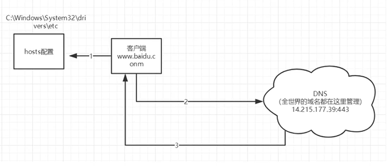

## 3.4 发布一个web网站

将自己写的网站，放到服务器(Tomcat)中指定的web应用的文件夹（webapps）下，就可以访问了

网站应该有的结构

```java
--webapps ：Tomcat服务器的web目录
    -ROOT
    - demoweb ：网站的目录名
        - WEB-INF
            -classes : java程序
            -lib：web应用所依赖的jar包
            -web.xml ：网站配置文件
    - index.html 默认的首页
    - static
        -css
            -style.css
        -js
        -img
        -.....
```


# 4.Http

## 4.1 什么是http

HTTP（超文本传输协议）是一个简单的请求-响应协议，它通常运行在TCP之上。

- 文本：html，字符串…
- 超文本：图片，音乐，视频，定位，地图…
- 默认端口：80
  HTTPS：安全的协议
- 默认端口：443

## 4.2 http的两个时代

- http1.0：客户端可以与web服务器连接后，只能获得一个web资源，断开连接。
- http2.0：客户端可以与web服务器连接后，可以获得多个web资源。

## 4.3 http请求

客户端—->发请求(request)—->服务器（比如：访问百度）
`General`

```
// 请求地址
Request URL: https://www.baidu.com/
// 请求方法
Request Method: GET
// 状态代码
Status Code: 200 OK
// 远程地址
Remote Address: 14.215.177.38:443
// 引用站点策略
Referrer Policy: strict-origin-when-cross-origin
```

`Request Headers`

```
Request Headers
Accept: text/htmlAccept-Encoding: gzip, deflate, br// 语言Accept-Language: zh-CN,zh;q=0.9Cache-Control: max-age=0Connection: keep-alive
```

**请求行**

- 请求行中的请求方式：GET
- 请求方式：Get，Post，HEAD，DELETE，PUT…
  GET:请求能够携带的参数比较少，大小有限制，会在浏览器的URL地址栏显示数据内容，不安全，但高效。
  POST:请求能够携带的参数没有限制，大小没有限制，不会在浏览器的URL地址栏显示数据内容，安全，但不高效。

**请求头（消息头）**

```
Accept: 告诉浏览器，它所支持的数据类型
Accept-Encoding: 告诉浏览器，它支持哪种编码格式：GBK,UTF-8,GB2312,ISO8859-1
Accept-Language: 告诉浏览器，它的语言环境
Cache-Control: 缓存控制
Connection: 告诉浏览器，请求完成是断开还是保持
HOST：主机
```

## 4.4 http响应

**响应头**

```
// 缓存控制
Cache-Control: no-cache
// 保持连接（http1.1）
Connection: keep-alive
// 文本编码类型
Content-Encoding: gzip
// 响应类型
Content-Type: text/html;charset=utf-8
```

**响应体**

```
Accept: 告诉浏览器，它所支持的数据类型
Accept-Encoding: 告诉浏览器，它支持哪种编码格式：GBK,UTF-8,GB2312,ISO8859-1
Accept-Language: 告诉浏览器，它的语言环境
Cache-Control: 缓存控制
Connection: 告诉浏览器，请求完成是断开还是保持
HOST：主机
Refrush：告诉客户端，多久刷新一次
Location：让网页重新定位
```

**响应状态码**

- 200：响应成功
- 3xx：请求重定向（304等等）
- 4xx：找不到资源（404等等）
- 5xx：服务器代码错误（500代码错误，502网关错误）

# 5.Maven

## 5.1、Maven项目架构管理工具

**好处方便导入jar包的**

Maven的核心思想：**约定大于配置**

## 下载安装Maven

官网;https://maven.apache.org/


下载完成后，解压即可；

## 5.3、配置环境变量

在系统环境变量中

配置以下配置：

1. MAVEN_HOME maven的目录
2. 在系统的path中配置 %MAVEN_HOME%\bin
3. 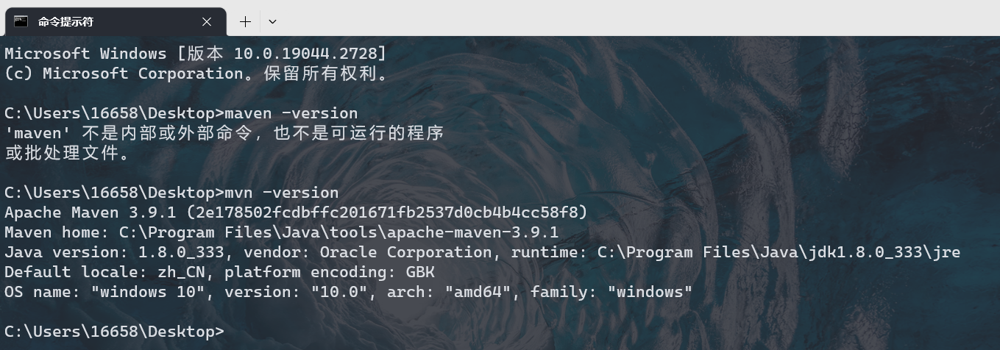
4. 测试Maven是否安装成功，保证必须配置完毕！

## 5.4、配置阿里云加速镜像

使用阿里云Maven中央仓库作为下载源，速度更快更稳定。

- maven 安装目录的 `conf/settings.xml`

- 在`<mirrors></mirrors>`标签中添加 `mirror`子节点

  ```
  <mirror>
  <id>aliyunmaven</id>
  <mirrorOf>*</mirrorOf>
  <name>阿里云公共仓库</name>
  <url>https://maven.aliyun.com/repository/public</url>
  </mirror>
  ```

## 5.5、本地仓库

修改本地的仓库存放位置

- maven 安装目录的 `conf/settings.xml`
- 在`<settings></settings>`标签中添加 `localRepository`子节点，按个人习惯存放。

```
<localRepository>C:\Program Files\Java\tools\apache-maven-3.9.1\maven-repo</localRepository>
```

## 5.6、在IDEA中使用Maven

### 永久设置项目的maven配置方法

1、启动IDEA

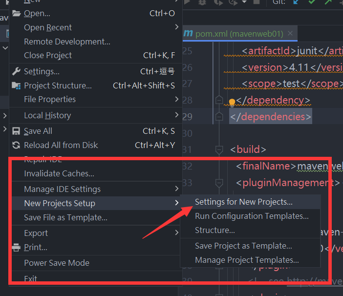


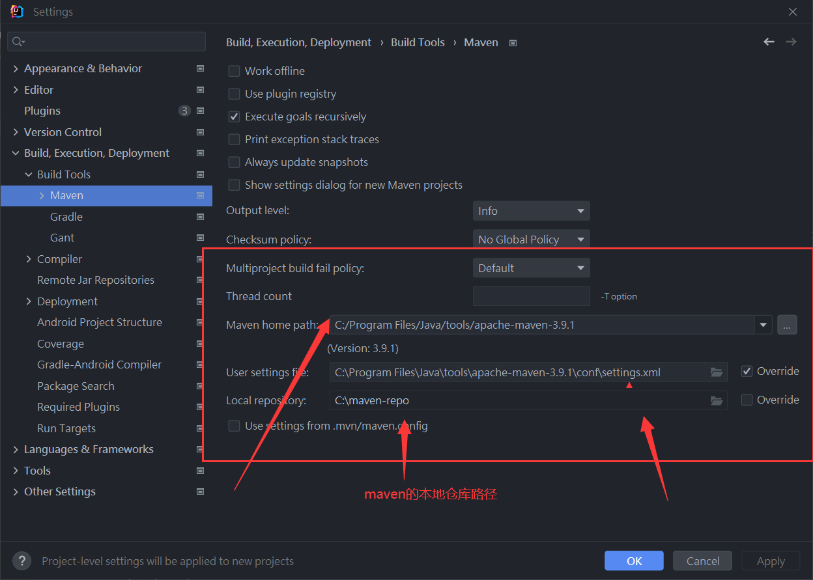

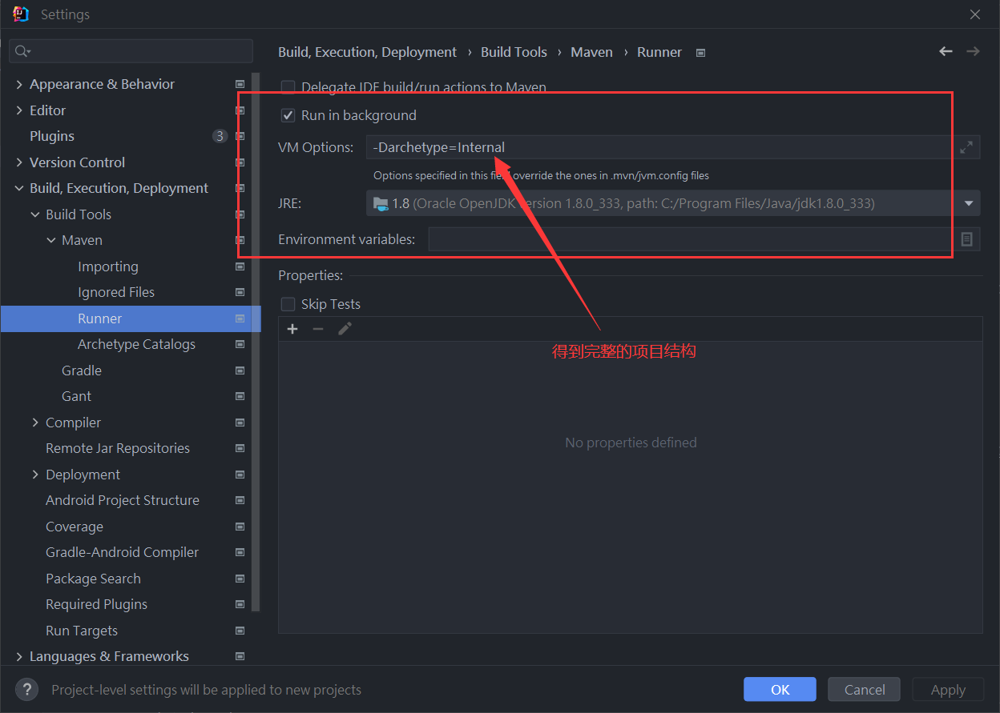


2、 创建一个MavenWeb项目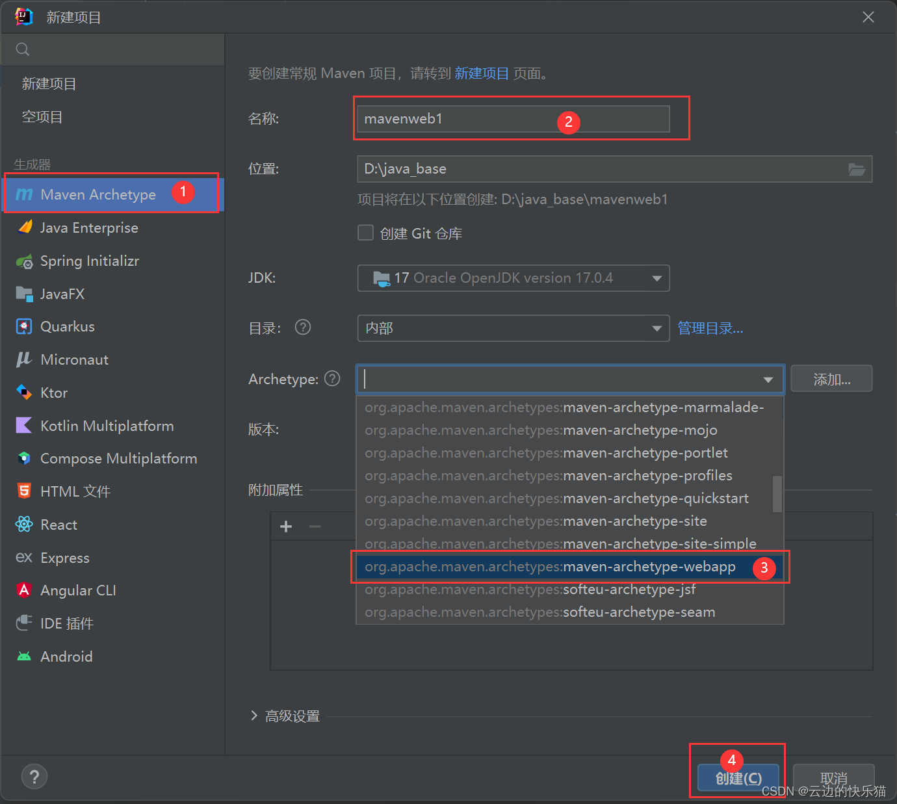

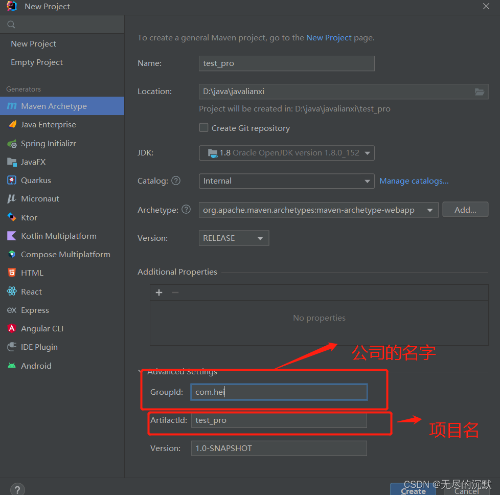

**等待构建成功：** 

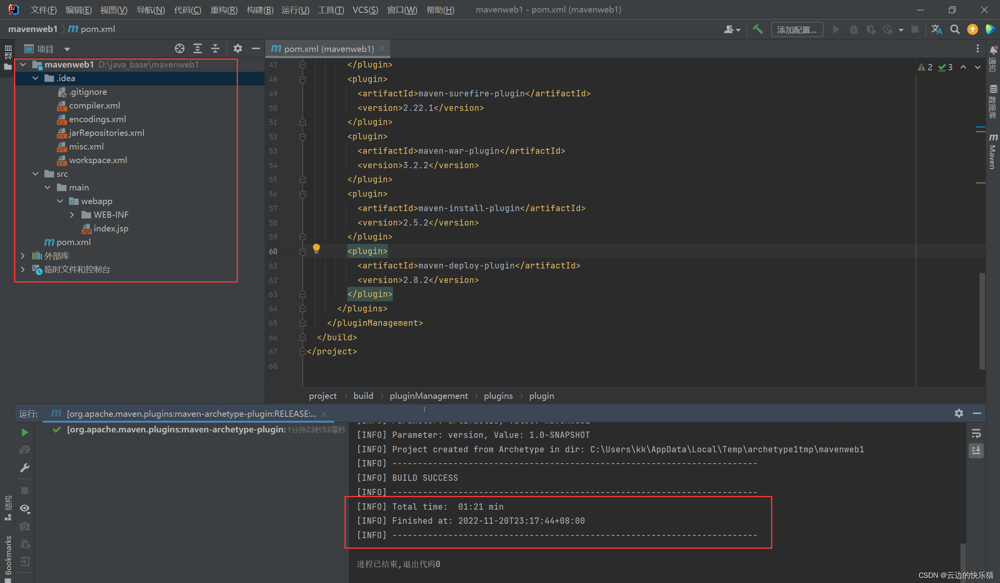

 **3.删除pom.xml中多余的插件，从war往下删到剩一个</project>**

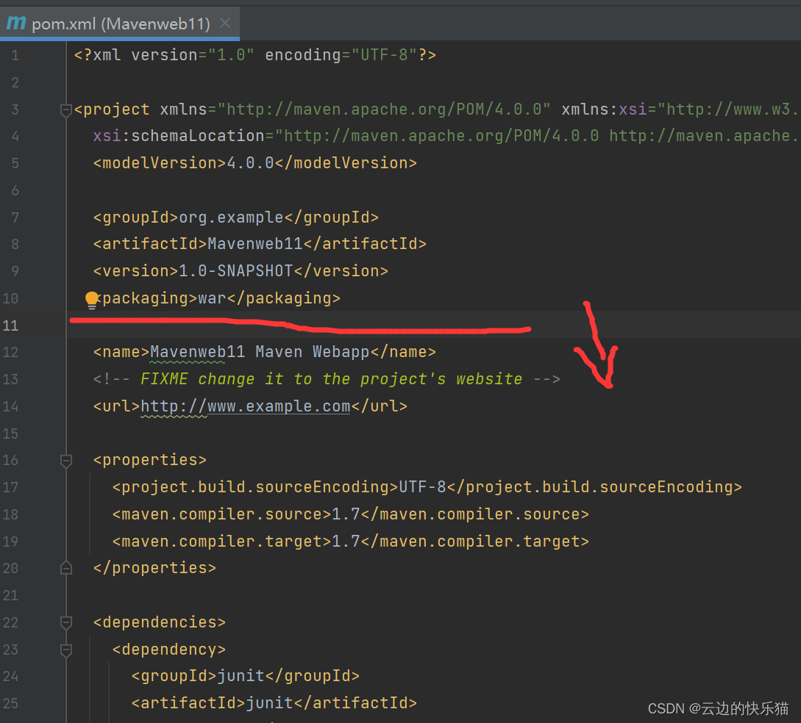

 成果：

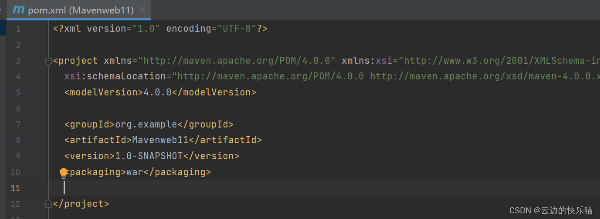

**4. 右键main-->新建-->目录**

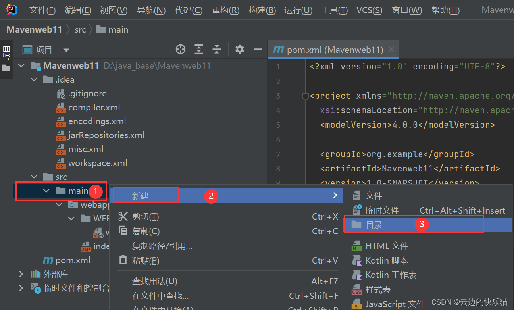

根据提示补齐这两个目录（分两次添加进来就好了）

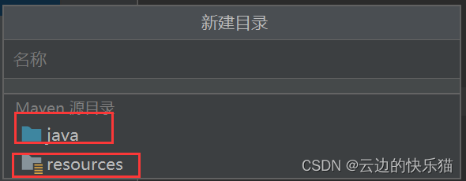

成果：这样就补齐成功了

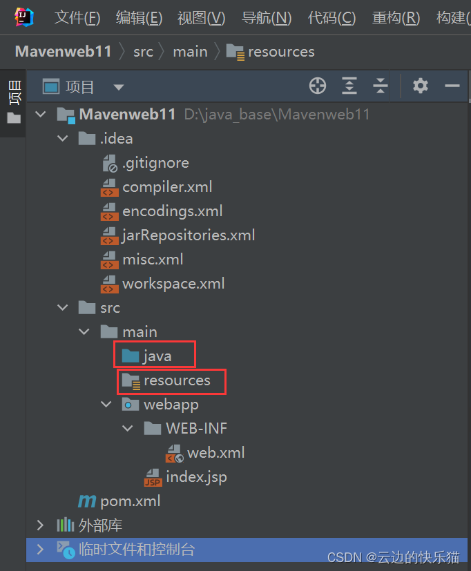

 **最终成果展示**

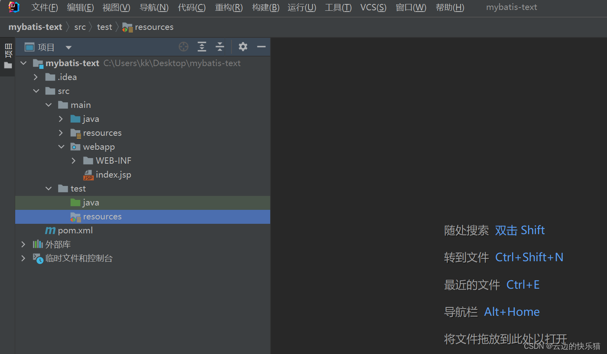

**5.检查IDEA中的Maven设置**


## 5.7、创建一个普通的Maven项目


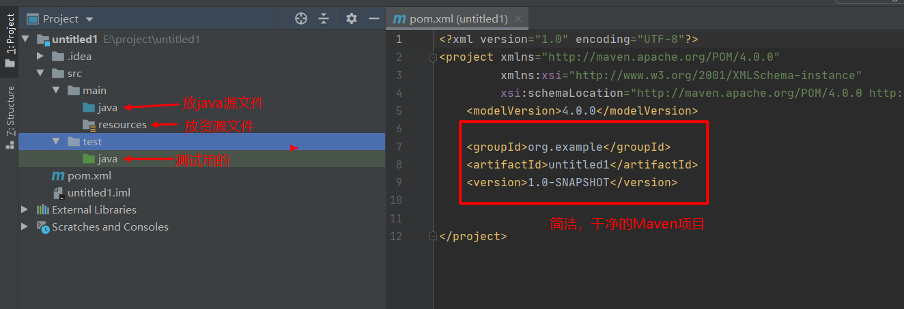

只有在**Web应用下才有**的项目结构


## 5.8、标记文件夹功能

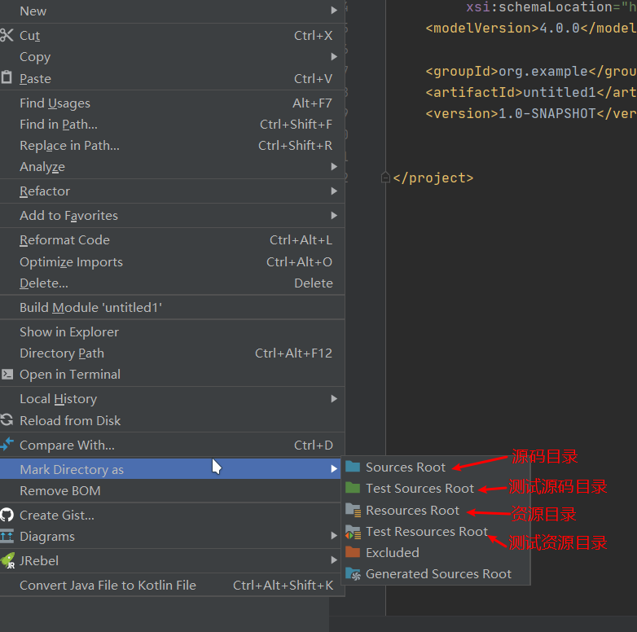

## 5.9、在 IDEA中配置Tomcat

**1、添加tomcat**


**2、相关配置**

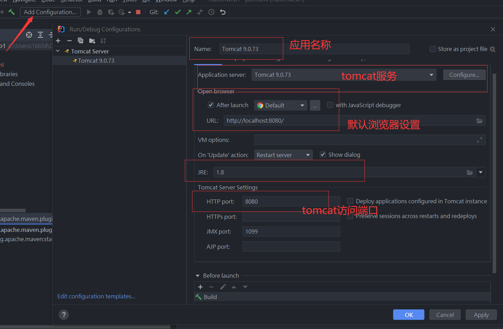

**3、关联网站**


4、**启动tomcat**

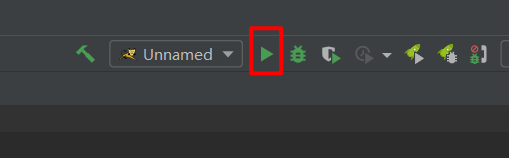

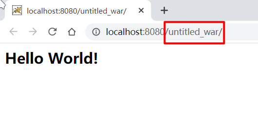

## 5.10、pom文件

**pom.xml 是Maven的核心配置文件.**

```xml
This XML file does not appear to have any style information associated with it. The document tree is shown below.
<project xmlns="http://maven.apache.org/POM/4.0.0" xmlns:xsi="http://www.w3.org/2001/XMLSchema-instance" xsi:schemaLocation="http://maven.apache.org/POM/4.0.0 http://maven.apache.org/xsd/maven-4.0.0.xsd">
<modelVersion>4.0.0</modelVersion>
<!-- 项目信息  -->
<groupId>org.example</groupId>
<artifactId>mavenweb01</artifactId>
<version>1.0-SNAPSHOT</version>
<modules>
<module>servlet-01</module>
<module>servlet-02</module>
<module>servlet-03</module>
<module>response</module>
<module>request</module>
</modules>
<!-- 顶目打包方式
  iar: java应用
  War: JavaWeb应用
   -->
<packaging>pom</packaging>
<name>mavenweb01 Maven Webapp</name>
<!--  FIXME change it to the project's website  -->
<url>http://www.example.com</url>
<!-- 配置 -->
<properties>
<project.build.sourceEncoding>UTF-8</project.build.sourceEncoding>
<maven.compiler.source>1.7</maven.compiler.source>
<maven.compiler.target>1.7</maven.compiler.target>
</properties>
<!-- 项目依赖 -->
<dependencies>
<dependency>
<groupId>junit</groupId>
<artifactId>junit</artifactId>
<version>4.11</version>
<scope>test</scope>
</dependency>
<!--  servlet  -->
<dependency>
<groupId>javax.servlet</groupId>
<artifactId>javax.servlet-api</artifactId>
<version>3.1.0</version>
<scope>provided</scope>
</dependency>
<!--  jsp  -->
<dependency>
<groupId>javax.servlet.jsp</groupId>
<artifactId>javax.servlet.jsp-api</artifactId>
<version>2.3.3</version>
<scope>provided</scope>
</dependency>
<!-- avaServer Pages(TM) API  -->
<!--  https://mvnrepository.com/artifact/javax.servlet.jsp/jsp-api  -->
<dependency>
<groupId>javax.servlet.jsp</groupId>
<artifactId>jsp-api</artifactId>
<version>2.1</version>
<scope>provided</scope>
</dependency>
</dependencies>
<build>
<!-- 在build中配置resources，来防止我们资源导出失败的问题 -->
<resources>
<resource>
<directory>src/main/resources</directory>
<includes>
<include>**/*.properties</include>
<include>**/*.xml</include>
</includes>
<filtering>true</filtering>
</resource>
<resource>
<directory>src/main/java</directory>
<includes>
<include>**/*.properties</include>
<include>**/*.xml</include>
</includes>
<filtering>true</filtering>
</resource>
</resources>
<finalName>mavenweb01</finalName>
<pluginManagement>
<!--  lock down plugins versions to avoid using Maven defaults (may be moved to parent pom)  -->
<plugins>
<plugin>
<artifactId>maven-clean-plugin</artifactId>
<version>3.1.0</version>
</plugin>
<!--  see http://maven.apache.org/ref/current/maven-core/default-bindings.html#Plugin_bindings_for_war_packaging  -->
<plugin>
<artifactId>maven-resources-plugin</artifactId>
<version>3.0.2</version>
</plugin>
<plugin>
<artifactId>maven-compiler-plugin</artifactId>
<version>3.8.0</version>
</plugin>
<plugin>
<artifactId>maven-surefire-plugin</artifactId>
<version>2.22.1</version>
</plugin>
<plugin>
<artifactId>maven-war-plugin</artifactId>
<version>3.2.2</version>
</plugin>
<plugin>
<artifactId>maven-install-plugin</artifactId>
<version>2.5.2</version>
</plugin>
<plugin>
<artifactId>maven-deploy-plugin</artifactId>
<version>2.8.2</version>
</plugin>
</plugins>
</pluginManagement>
</build>
</project>
```

记录了项目具体依赖的Jar包的配置版本。


maven由于它是约定大于配置，之后可以能遇到写的配置文件不生效的问题。

解决方案：

```
<!--在build中配置resources，来防止我们资源导出失败的问题-->
<build>
    <resources>
        <resource>
            <directory>src/main/resources</directory>
            <includes>
                <include>**/*.properties</include>
                <include>**/*.xml</include>
            </includes>
            <filtering>true</filtering>
        </resource>
        <resource>
            <directory>src/main/java</directory>
            <includes>
                <include>**/*.properties</include>
                <include>**/*.xml</include>
            </includes>
            <filtering>true</filtering>
        </resource>
    </resources>
</build>
```

## 5.12、Maven仓库的使用

地址：https://mvnrepository.com/

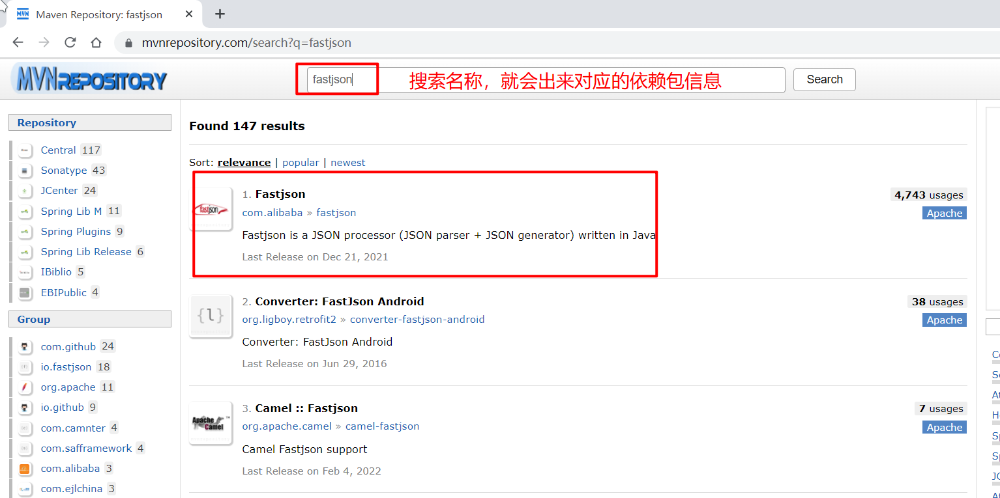

点击进去，可以查看到使用的人数及版本更新时间


点击对应的版本，里面有maven引用的配置信息，复制到本地的POM.xml下，重新引用一下依赖，就可以导致对应的Jar包。

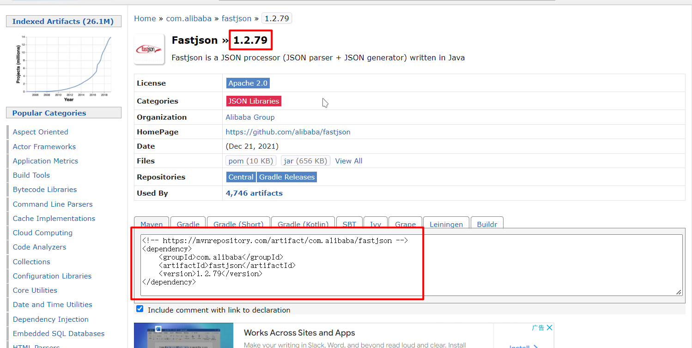

查询项目的依赖就导入进来了。


# 6. Servlet

## 6.1. Servlet简介

Servlet用java语言开发动态资源网站的技术。

**把实现了Servlet接口的Java程序叫做，Servlet**

servlet生成的class文件存放在tomcat中webapps目录下。

## 6.2. HelloServlet

Serlvet接口有两个默认的实现类：`HttpServlet`，`GenericServlet`

Serlvet接口Sun公司有两个默认的实现类：HttpServlet，GenericServlet
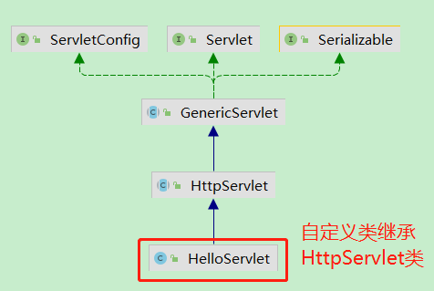

1. 构建一个普通的Maven项目，删掉里面的src目录，作为父项目.  以后这个项目里面建立Moudel；这个空的工程就是Maven主工程；(方便学习)

1. 父工程中pom.xml会有：

   ```xml
        <modules>
            <module>servlet-01</module>
        </modules>
   ```

   子项目pom.xml中会有：

   ```xml
        <parent>
            <groupId>org.example</groupId>
            <artifactId>javaweb-servlet</artifactId>
            <version>1.0-SNAPSHOT</version>
        </parent>
   ```

   父项目中的jar包，子项目可以直接使用。反之，不可。

   

1、构建一个普通的Maven项目，删掉里面的src目录，以后我们的学习就在这个项目里面建立 Moudel；这个空的工程就是Maven主工程；

**在父工程引用相关的Jar包**

普通maven转web项目 https://www.cnblogs.com/jichi/p/11356759.html

```xml
<!-- servlet -->
<dependency>
    <groupId>javax.servlet</groupId>
    <artifactId>javax.servlet-api</artifactId>
    <version>3.1.0</version>
    <scope>provided</scope>
</dependency>
<!-- jsp -->
<dependency>
    <groupId>javax.servlet.jsp</groupId>
    <artifactId>javax.servlet.jsp-api</artifactId>
    <version>2.3.3</version>
    <scope>provided</scope>
</dependency>
```

**子项目**

编写一个普通类，继承HttpServlet

```java
public class HelloWorld extends HttpServlet {
	@Override
	protected void doGet(HttpServletRequest req, HttpServletResponse resp) throws ServletException, IOException {
		//super.doGet(req, resp);
		PrintWriter writer = resp.getWriter();
		writer.print("Hello,Servlet");
	}

	@Override
	protected void doPost(HttpServletRequest req, HttpServletResponse resp) throws ServletException, IOException {
		super.doPost(req, resp);
	}
}
```

**Servlet的映射**

映射：我们写的是JAVA程序，但是要通过浏览器访问，而浏览器需要连接web服务器， 所以我们需要再web服务中注册我们写的Servlet，让浏览器找到我们java程序的发布目录

在**web.xml文件**中做serlet映射

```xml
  <!--注册Servlet-->
  <servlet>
    <servlet-name>hello</servlet-name>
    <servlet-class>com.jindao.servlet.HelloWorld</servlet-class>
  </servlet>
  <!--Servlet的请求路径-->
  <servlet-mapping>
    <servlet-name>hello</servlet-name>
    <url-pattern>/hello</url-pattern>
  </servlet-mapping>
```

3.5、子项目配置Tomcat，并访问。

**更改一下虚拟访问的路径:**

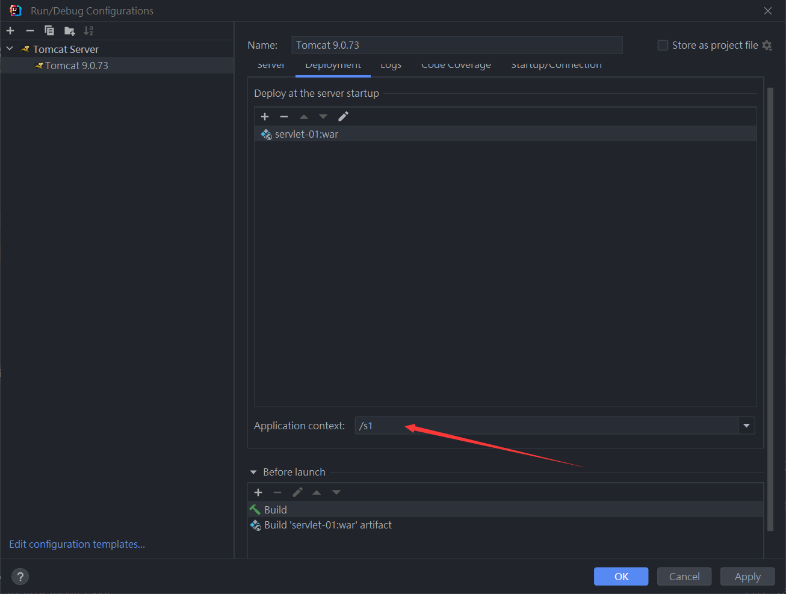

**运行:**

首页: index.jsp显示的内容

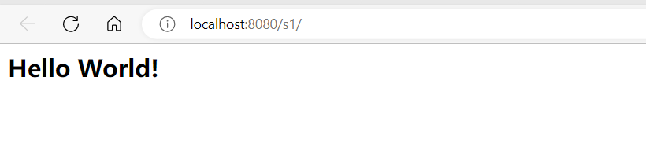

servlet中java程序显示的

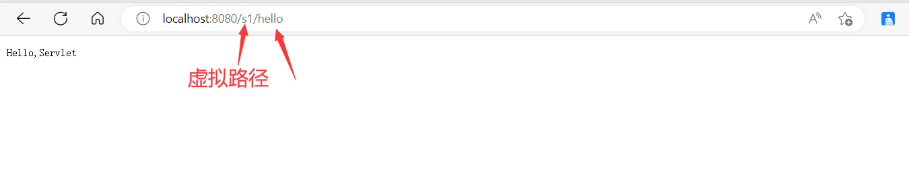

项目结构:

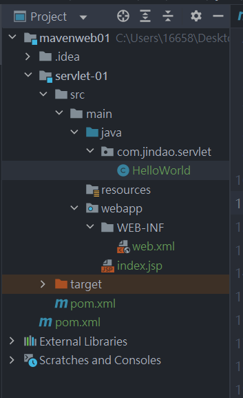

## 6.3 Servlet原理

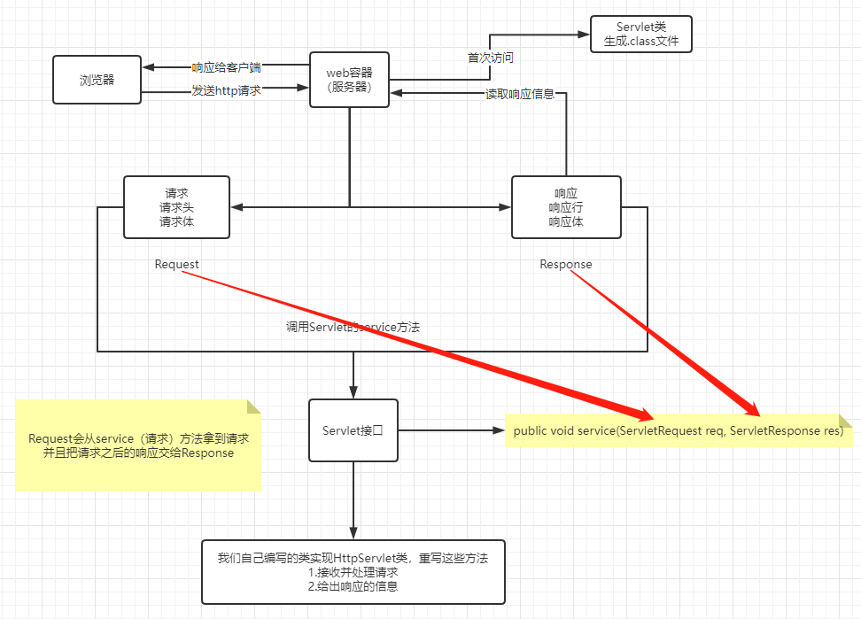

## 6.4.  Servlet映射问题(每个java文件都得做映射)

1、一个Servlet可以指定一个映射路径

```xml
<servlet-mapping>
    <servlet-name>hello</servlet-name>    <!--注册的servlet-->
    <url-pattern>/hello</url-pattern>     <!--url请求路径-->
</servlet-mapping>
```

2、一个Servlet可以指定多个映射路径

```
<servlet-mapping>
    <servlet-name>hello</servlet-name>  
    <url-pattern>/hello</url-pattern>
</servlet-mapping>
<servlet-mapping>
    <servlet-name>hello</servlet-name>
    <url-pattern>/hello2</url-pattern>
</servlet-mapping>
<servlet-mapping>
    <servlet-name>hello</servlet-name>
    <url-pattern>/hello3</url-pattern>
</servlet-mapping>
<servlet-mapping>
    <servlet-name>hello</servlet-name>
    <url-pattern>/hello4</url-pattern>
</servlet-mapping>
<servlet-mapping>
    <servlet-name>hello</servlet-name>
    <url-pattern>/hello5</url-pattern>
</servlet-mapping>
```

3、一个Servlet可以指定通用映射路径

```
<servlet-mapping>
    <servlet-name>hello</servlet-name>
    <url-pattern>/hello/*</url-pattern>
</servlet-mapping>
```

4、作为默认请求路径

```
<servlet-mapping>
    <servlet-name>hello</servlet-name>
    <url-pattern>/*</url-pattern>
</servlet-mapping>
```

5、指定一些后缀或者前缀等等…

```xml
<!-- 注意，*前面不能加项目映射的路径-->
<servlet-mapping>
    <servlet-name>hello</servlet-name>
    <url-pattern>*.demo</url-pattern>
</servlet-mapping>
```

6、优先级问题
指定了固有的映射路径优先级最高**，如果找不到就会走默认的处理请求**；

```xml
<!--404-->
<servlet>
    <servlet-name>error</servlet-name>
    <servlet-class>com.jindao.servlet.ErrorServlet</servlet-class>
</servlet>

<servlet-mapping>
    <servlet-name>error</servlet-name>
    <url-pattern>/*</url-pattern>
</servlet-mapping>
```

## 6.5、ServletContext类

web容器在启动的时候，它会为每个web程序都创建一个对应的ServletContext对象，它代表了当前的web应用。

### 1、共享数据

我在这个Servlet中保存的数据，可以在另外一个servlet中拿到；

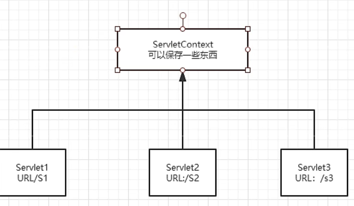

**将一个共享数据保存在了ServletContext : **

```java
public class HelloServlet extends HttpServlet {
	@Override
	protected void doGet(HttpServletRequest req, HttpServletResponse resp) throws ServletException, IOException {
         //this.getInitParameter() 初始化参数
        //this.getServletConfig() Servlet配置
        //this.getServletContext() Servlet上下文
		ServletContext context = this.getServletContext();
		String username = "小明"; //数据
		context.setAttribute("username", username);  //将一个数据保存在了ServletContext
	}
}
```

**从ServletContext获取username值的对象出来**

```java
public class GetServlet extends HttpServlet {
	@Override
	protected void doGet(HttpServletRequest req, HttpServletResponse resp) throws ServletException, IOException {
		ServletContext context = this.getServletContext();
		//从ServletContext获取username值的对象出来
		String username = (String) context.getAttribute("username");
		resp.setContentType("text/html");
		resp.setCharacterEncoding("utf-8");
		resp.getWriter().print("名字:"+username);
	}
```

在**web.xml文件**中做serlet映射

```xml
  <!--注册Servlet-->
  <servlet>
    <servlet-name>hello</servlet-name>
    <servlet-class>com.jindao.servlet.HelloServlet </servlet-class>
  </servlet>
  <servlet>
    <servlet-name>getc</servlet-name>
    <servlet-class>com.jindao.servlet.GetServlet</servlet-class>
  </servlet>

  <!--Servlet的请求路径-->
  <servlet-mapping>
    <servlet-name>hello</servlet-name>
    <url-pattern>/hello</url-pattern>
  </servlet-mapping>
  <servlet-mapping>
    <servlet-name>getc</servlet-name>
    <url-pattern>/getc</url-pattern>
  </servlet-mapping>
```

**测试运行结果**

### 2、获取初始化参数

在**web.xml文件**中操作

```xml
<!--配置一些web应用初始化参数-->
<context-param>
    <param-name>application-name</param-name>
    <param-value>学习Servlet</param-value>
</context-param>
```

```java
protected void doGet(HttpServletRequest req, HttpServletResponse resp) throws  ServletException, IOException {
    ServletContext context = this.getServletContext();
    String url = context.getInitParameter("application-name");
    resp.setContentType("text/html");
    resp.setCharacterEncoding("utf-8");
    resp.getWriter().print(url);
}
```

### 3、请求转发

```java
    @Override
    protected void doGet(HttpServletRequest req, HttpServletResponse resp) throws ServletException, IOException {
        ServletContext context = this.getServletContext();
        System.out.println("进入了DemoServlet4");
        //RequestDispatcher requestDispatcher = context.getRequestDispatcher("/demo4"); //转发的请求路径
        //requestDispatcher.forward(req,resp); //调用forward实现请求转发；
        context.getRequestDispatcher("/demo3").forward(req,resp);  // 进入demo3页面
    }
```

```xml
// web.xml文件
// 请求sd4
<servlet>
 <servlet-name>gp</servlet-name>
 <servlet-class>com.sunyiwenlong.servlet.ServletDemo03</servlet-class>
</servlet>
<servlet-mapping>
 <servlet-name>gp</servlet-name>
 <url-pattern>/gp</url-pattern>
</servlet-mapping>
<servlet>
 <servlet-name>sd4</servlet-name>
 <servlet-class>com.sunyiwenlong.servlet.ServletDemo04</servlet-class>
</servlet>
<servlet-mapping>
 <servlet-name>sd4</servlet-name>
 <url-pattern>/sd4</url-pattern>
</servlet-mapping>
```


### 4、读取资源文件

1. Properties

- 在java目录下新建properties
- **在resources目录下新建properties发现：都被打包到了同一个路径下：classes，我们俗称这个路径为classpath。**

思路：需要一个文件流

```java
    @Override
    protected void doGet(HttpServletRequest req, HttpServletResponse resp) throws ServletException, IOException {
        InputStream is = this.getServletContext().getResourceAsStream("/WEB-INF/db.properties");  //需要一个文件流
        Properties prop = new Properties();
        prop.load(is);
        String user = prop.getProperty("username");
        String pwd = prop.getProperty("password");
        resp.getWriter().print(user+":"+pwd);  // 发送
    }
```

在**web.xml文件**中做serlet映射

**测试运行结果**

## 6.6. HttpServletResponse

web服务器接收到客户端的http请求，针对这个请求，分别创建一个**代表请求的HttpServletRequest对 象**，**代表响应的一个HttpServletResponse；**

- 获取客户端请求过来的参数：`HttpServletRequest`
- 响应客户端响应一些信息：`HttpServletResponse`

1、**向浏览器输出消息**

```java
public ServletOutputStream getOutputStream() throws IOException;
public PrintWriter getWriter() throws IOException;
```

**2、响应的状态码**

```java
public static final int SC_CONTINUE = 100;
 /**
  * Status code (200) indicating the request succeeded normally.
  */
 public static final int SC_OK = 200;
 /**
  * Status code (302) indicating that the resource has temporarily
  * moved to another location, but that future references should
  * still use the original URI to access the resource.
  *
  * This definition is being retained for backwards compatibility.
  * SC_FOUND is now the preferred definition.
  */
 public static final int SC_MOVED_TEMPORARILY = 302;
 /**
 * Status code (302) indicating that the resource reside
 * temporarily under a different URI. Since the redirection might
 * be altered on occasion, the client should continue to use the
 * Request-URI for future requests.(HTTP/1.1) To represent the
 * status code (302), it is recommended to use this variable.
 */
 public static final int SC_FOUND = 302;
 /**
  * Status code (304) indicating that a conditional GET operation
  * found that the resource was available and not modified.
  */
 public static final int SC_NOT_MODIFIED = 304;
 /**
  * Status code (404) indicating that the requested resource is not
  * available.
  */
 public static final int SC_NOT_FOUND = 404;
 /**
  * Status code (500) indicating an error inside the HTTP server
  * which prevented it from fulfilling the request.
  */
 public static final int SC_INTERNAL_SERVER_ERROR = 500;
 /**
  * Status code (502) indicating that the HTTP server received an
  * invalid response from a server it consulted when acting as a
  * proxy or gateway.
  */
 public static final int SC_BAD_GATEWAY = 502;
 // ...
```

**常见应用:**

2、常见应用

1.向浏览器输出消息 (之前那些)

```java
public class HelloWorld extends HttpServlet {
    @Override
    protected void doGet(HttpServletRequest req, HttpServletResponse resp) throws ServletException, IOException {
        PrintWriter writer = resp.getWriter(); //响应流
        writer.print("Hello,Servlet");
    }
    @Override
    protected void doPost(HttpServletRequest req, HttpServletResponse resp) throws ServletException, IOException {
        doGet(req, resp);         
    }
}
```

2. 下载文件

```
1. 要获取下载文件的路径
2. 下载的文件名
3. 设置想办法训浏览器能够支持下载我们需要的东西
4. 获取下载文件的输入流
5. 创建缓冲区
6. 获取OutputStream对象
7，将FileoutputStream流写入到buffer缓冲区
8. 使用OutputStream将缓冲区中的数据输出到客户端!
```

```java

public class FileServlet extends HttpServlet {
	@Override
	protected void doGet(HttpServletRequest req, HttpServletResponse resp) throws ServletException, IOException {
//		1. 要获取下载文件的路径
		//String realPath = this.getServletContext().getRealPath("/1.png");
		String realPath = "C:\\Users\\16658\\Desktop\\java\\java\\note\\JavaWeb\\code\\mavenweb01\\response\\src\\main\\resources\\1.png";
		System.out.println("下载文件的路径: " + realPath);

//		2. 下载的文件名
		String filename = realPath.substring(realPath.lastIndexOf("\\") + 1);// 1.png
//		3. 设置想办法训浏览器能够支持下载我们需要的东西
		resp.setHeader("Content-disposition","attachment;filename="+ URLEncoder.encode(filename,"utf-8"));
//		4. 获取下载文件的输入流
		FileInputStream in = new FileInputStream(realPath);
//		5. 创建缓冲区
		int len = 0;
		byte[] buffer = new byte[1024];// 每次读取的长度
//		6. 获取OutputStream对象
		ServletOutputStream out = resp.getOutputStream();
//		7.将FileoutputStream流写入到buffer缓冲区
		while ((len = in.read(buffer))>0){// 每次读取的长度大于0的情况下，就写出去
			out.write(buffer,0,len);// 写出字节，从0写到len
		}
		// 8.使用OutputStream将缓冲区中的数据输出到客户端！
		in.close();
		out.close();
	}
}
```

3.验证码功能

```java
public class ImageServlet extends HttpServlet {
 @Override
 protected void doGet(HttpServletRequest req, HttpServletResponse resp) throws ServletException, IOException {
     // 让浏览器3秒刷新一次
     resp.setHeader("refresh", "3");
     // 在内存中创建一个图片
     BufferedImage image = new BufferedImage(80, 20, BufferedImage.TYPE_INT_RGB);// 宽、高、颜色
     // 得到图片
     Graphics2D g = (Graphics2D) image.getGraphics();// 得到一只2D的笔
     // 设置图片的背景颜色
     g.setColor(Color.white);
     g.fillRect(0, 0, 80, 20);// 填充颜色
     // 换个背景颜色
     g.setColor(Color.BLUE);
     // 设置字体样式：粗体，20
     g.setFont(new Font(null,Font.BOLD,20));
     // 画一个字符串（给图片写数据）
     g.drawString(makeNum(),0,20);
     // 告诉浏览器，这个请求用图片的方式打开
     resp.setContentType("image/jpeg");
     // 网站存在缓存，不让浏览器缓存
     resp.setDateHeader("expires",-1);
     resp.setHeader("Cache-Control","no-cache");
     resp.setHeader("Pragma","no-cache");
     // 把图片写给浏览器
     boolean write = ImageIO.write(image, "jpg",resp.getOutputStream());
 }
 // 生成随机数
 private String makeNum() {
     Random random = new Random();
     String num = random.nextInt(9999999) + "";// 随机数，最大七位，[0,9999999)
     StringBuffer sb = new StringBuffer();
     for (int i = 0; i < 7 - num.length(); i++) {// 不足七位，则添加0
         sb.append("0");
     }
     num = sb.toString()+num;// 不足七位，在随机数前面添加0
     return num;
 }
 @Override
 protected void doPost(HttpServletRequest req, HttpServletResponse resp) throws ServletException, IOException {
     this.doGet(req, resp);
 }
}
```


### 4. **实现请求重定向(重要)**

B一个web资源收到客户端A请求后，B他会通知A客户端去访问另外一个web资源C，这个过程叫重定
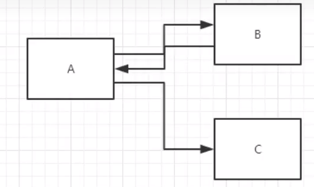

**应用场景:  用户登录**

- **转发**：
  - **客户端浏览器的地址栏没有变化**
  - 服务端内部转发
  - 刷新会重新提交数据
  - 会保存请求域中数据
- **重定向**
  - 客户端浏览器的地址栏有变化
  - 客户端重新请求
  - 刷新不会重新提交数据
  - 不会保存请求域中数据

相同点：页面都会实现跳转

不同点：

- 请求转发的时候，url地址栏不会产生变化。307
- 重定向时候，url地址栏会发生变化。302

**转发流程**：

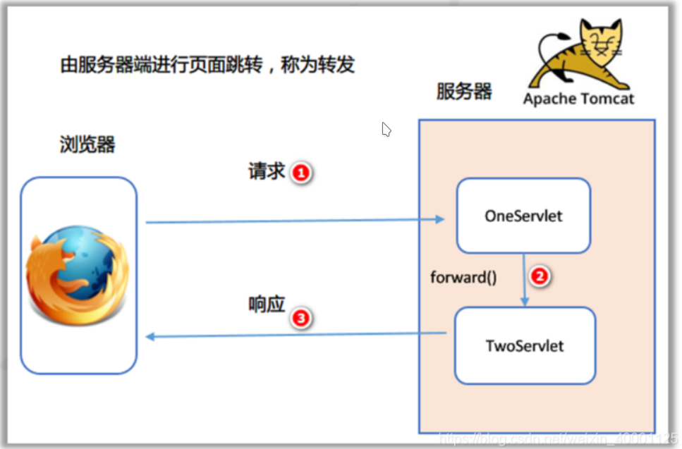

实现代码：

```
request.getRequestDispatcher("/地址").forward(request, response);
```

**重定向流程**：

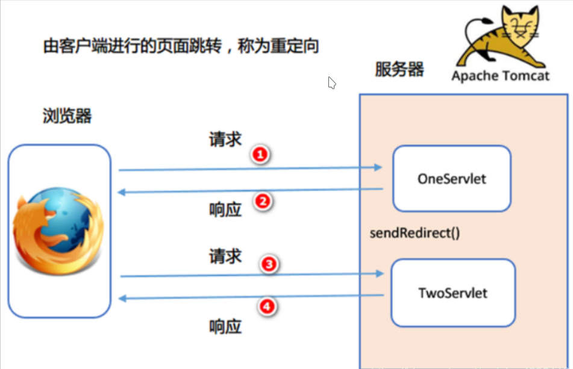


实现代码

```
response.sendRedirect("/地址");
```

转发和重定向

相同点:  页面都会实现跳转
不同点:   请求转发的时候，url不会产生变化,  重定向时候，url地址栏会发生变化；


**实现请求重定向**

==由客户端进行的页面跳转，称为重定向==

```java
public class RedirectServlet extends HttpServlet {
 @Override
 protected void doGet(HttpServletRequest req, HttpServletResponse resp) throws ServletException, IOException {
     /*resp.setHeader("Location","/response_war/image");
     resp.setStatus(HttpServletResponse.SC_NOT_MODIFIED);*/
     resp.sendRedirect("/response_war/image");// 重定向相当于上面两行代码  //参数:  虚拟访问路径/url请求路径
 }
 @Override
 protected void doPost(HttpServletRequest req, HttpServletResponse resp) throws ServletException, IOException {
     this.doGet(req, resp);
 }
}
```


应用:

**jsp文件**

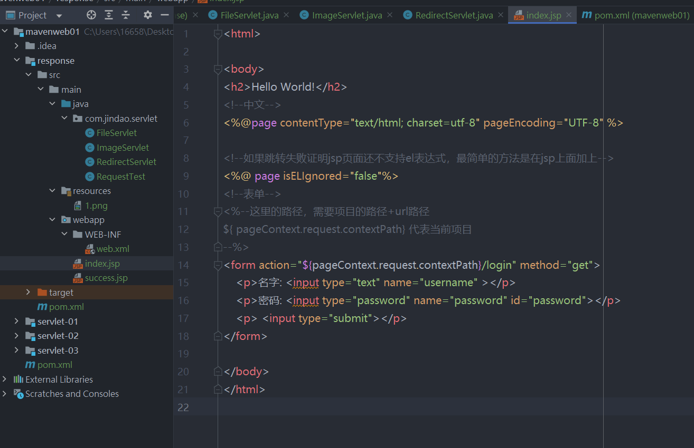

```jsp
<html>

<body>
<h2>Hello World!</h2>
<!--中文-->
<%@page contentType="text/html; charset=utf-8" pageEncoding="UTF-8" %>

<!--如果跳转失败证明jsp页面还不支持el表达式，最简单的方法是在jsp上面加上-->
<%@ page isELIgnored="false"%>
<!--表单-->
<%--这里的路径，需要项目的路径+url路径
${ pageContext.request.contextPath} 代表当前项目
--%>
<form action="${pageContext.request.contextPath}/login" method="get">
    <p>名字: <input type="text" name="username" ></p>
    <p>密码: <input type="password" name="password" id="password"></p>
    <p> <input type="submit"></p>
</form>

</body>
</html>

```

**重定向后跳转的jsp文件**

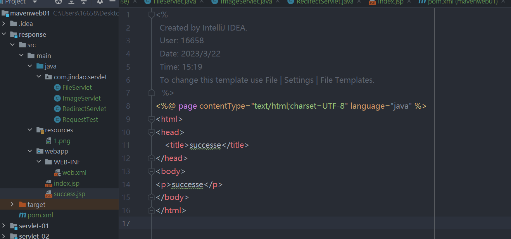

**实现重定向的文件**

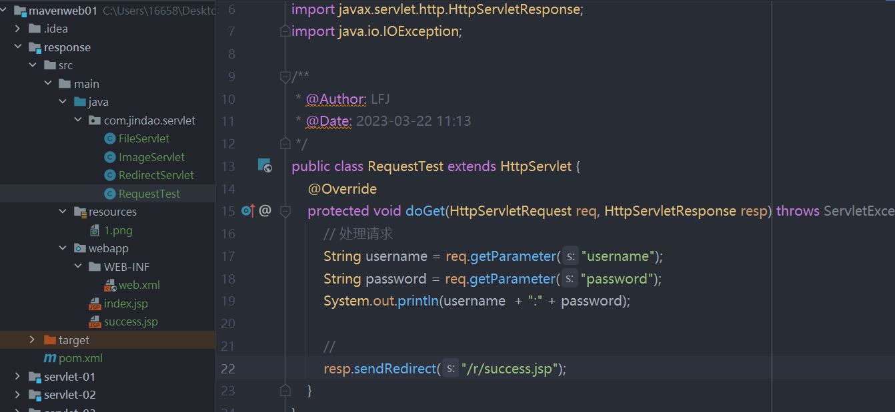

```java
 public class RequestTest extends HttpServlet {
	@Override
	protected void doGet(HttpServletRequest req, HttpServletResponse resp) throws ServletException, IOException {
		// 处理请求
		String username = req.getParameter("username");
		String password = req.getParameter("password");
		System.out.println(username  + ":" + password);
		//
		resp.sendRedirect("/r/success.jsp");
	}
}
```

运行效果

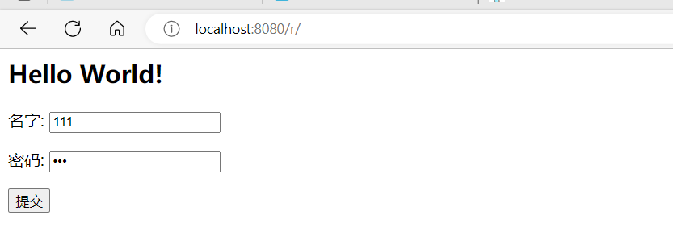

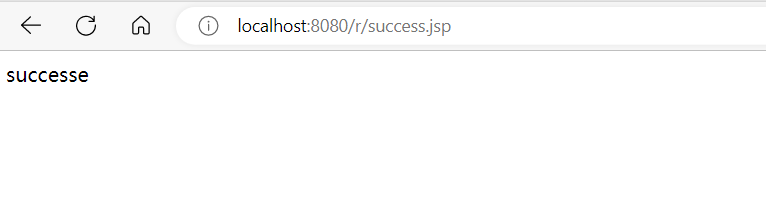

##  6.7. HttpServletRequest

HttpServletRequest代表客户端的请求，用户通过Http协议访问服务器，HTTP请求中的所有信息会被封装到HttpServletRequest，通过这个HttpServletRequest的方法，获得客户端的所有信息。

### 1. 获取前端传递的参数
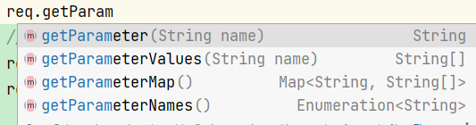

### 2. 请求转发

   **前端：**

   index.jsp页面

   ```jsp
   <%@ page contentType="text/html;charset=UTF-8" language="java" %>
   <%@ page isELIgnored="false"%>
   
   <html>
   <head>
       <title>登录</title>
   </head>
   <body>
   
   <h1>登录</h1>
   <div style="text-align: center">
   
       <form action="${pageContext.request.contextPath}/login" method="post">
               用户名:   <input type="text" name="username"> <br>
               密码：<input type="password" name="password"> <br >
               爱好:
               <input type="checkbox" name="hobbys" value="女孩">女孩
               <input type="checkbox" name="hobbys" value="代码">代码
               <input type="checkbox" name="hobbys" value="唱歌">唱歌
               <input type="checkbox" name="hobbys" value="电影"> 电影
           <br>
           <input type="submit">
       </form>
   </div>
   
   
   </body>
   </html>
   ```

   success.jsp页面

   ```jsp
   <%--
     Created by IntelliJ IDEA.
     User: 16658
     Date: 2023/3/22
     Time: 15:57
     To change this template use File | Settings | File Templates.
   --%>
   <%@ page contentType="text/html;charset=UTF-8" language="java" %>
   <html>
   <head>
       <title>success</title>
   </head>
   <body>
   <h1> 登录成功</h1>
   </body>
   </html>
   
   ```

**后端：**

```java
public class LoginServlet extends HttpServlet {
   @Override
   protected void doPost(HttpServletRequest req, HttpServletResponse resp) throws ServletException, IOException {
      String username = req.getParameter("username");
      String password = req.getParameter("password");
      String[] hobbys = req.getParameterValues("hobbys");

      System.out.println("=============");
      System.out.println(username);
      System.out.println(password);
      System.out.println(Arrays.toString(hobbys));

      // 转发 // 斜杠/就代表当前项目路径(虚拟路径)
      req.getRequestDispatcher("/success.jsp").forward(req, resp);
      
   }
}
```

**web.xml**

```
  <servlet>
    <servlet-name>loginServlet</servlet-name>
    <servlet-class>com.jindao.request.LoginServlet</servlet-class>
  </servlet>
  
  <servlet-mapping>
    <servlet-name>loginServlet</servlet-name>
    <url-pattern>/login</url-pattern>
  </servlet-mapping>

```

# 7. cookie/session

## 7.1 会话

无状态的会话：用户打开一个浏览器，点击了很多超链接，访问多个web资源，关闭浏览器，这个过程可以称之为会话。
有状态的会话：一个用户打开一个浏览器，访问某些资源（网站），下次再来访问该资源（网站），我们会知道这个用户曾经来过，称之为有状态会话；

```
一个网站，怎么证明你来过？
```

1. 服务端给客户端一个信件，客户端下次访问服务端带上信件就可以了；cookie（客户端）
2. 服务器登记你来过了，下次你来的时候我来匹配你；seesion（服务端）

## 7.2 保存会话的两种技术

cookie：

- 客户端技术，（响应、请求）

session：

- 服务端技术，利用这个技术，可以保存用户的会话信息.  我们可以把信息或者数据放在Session中。

## 7.3 Cookie

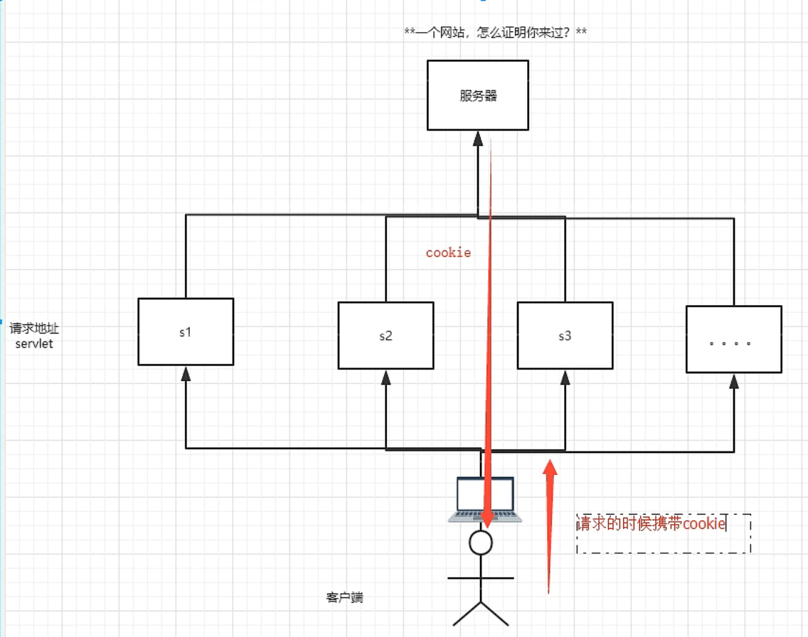

1、访问网站时，会返回cookie信息。

2、客户端访问时，需要带上cookie，方便知道你是谁。

```java
Cookie[] cookies = req.getCookies(); //获得Cookie
cookie.getName(); //获得cookie中的key
cookie.getValue(); //获得cookie中的vlaue

new Cookie("lastLoginTime", System.currentTimeMillis()+""); //新建一个cookie
cookie.setMaxAge(24*60*60); //设置cookie的有效期
resp.addCookie(cookie); //响应给客户端一个cookie
```

**cookie：一般会保存在本地的 用户目录下 appdata；**

- 一个Cookie只能保存一个信息；
- 一个web站点可以给浏览器发送多个cookie，最多存放20个cookie；
- Cookie大小有限制4kb；
- **300个cookie浏览器上限**

**删除Cookie**；

- 不设置有效期，关闭浏览器，自动失效；
- 设置有效期时间为 0 ；
- 解决coolie里有中文的情况:
- 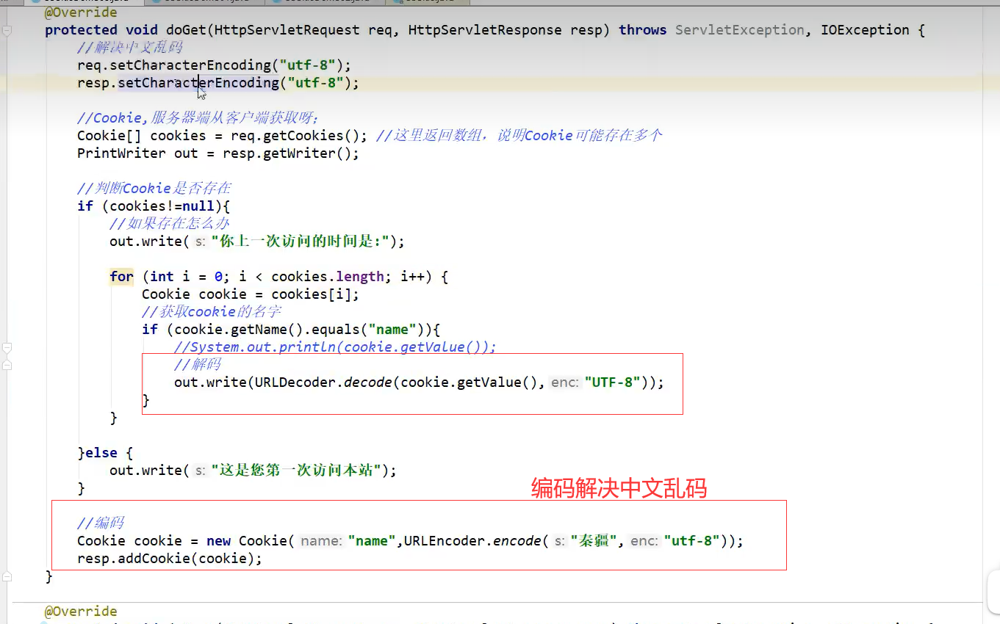

代码:

```java
package com.jindao.servlet;

import javax.servlet.ServletException;
import javax.servlet.http.Cookie;
import javax.servlet.http.HttpServlet;
import javax.servlet.http.HttpServletRequest;
import javax.servlet.http.HttpServletResponse;
import javax.xml.crypto.Data;
import java.io.IOException;
import java.io.PrintWriter;
import java.net.URLDecoder;
import java.util.Date;

public class CookieDemo01 extends HttpServlet {
	@Override
	protected void doGet(HttpServletRequest req, HttpServletResponse resp) throws ServletException, IOException {
		req.setCharacterEncoding("utf-16");
		resp.setCharacterEncoding("utf-16");

		PrintWriter out = resp.getWriter();  //向浏览器写入一些东西
		Cookie[] cookies = req.getCookies();  //这星返回数纽，说明Cookie可能存在多个

		// 判断cookie是否
		if (cookies != null){
			out.write("你上一次访问的时间");
			for (Cookie cookie : cookies) {
				// 获取cookie名字
				if (cookie.getName().equals("lastLoginTime")) {
					//获取cookie值
					long lastLoginTime = Long.parseLong(cookie.getValue());
					Date date = new Date(lastLoginTime);
					out.write(date.toLocaleString());
				}
			}
		}else {
			// 第一次访问
			out.write("这是您第一次访问本网站");
		}

		// 服务器响应一个cookie
		Cookie cookie = new Cookie("lastLoginTime", System.currentTimeMillis() + "");
		cookie.setMaxAge(24*60*60);  // 设置cookie的有效期为一天，单位是：秒
		resp.addCookie(cookie);
	}

	@Override
	protected void doPost(HttpServletRequest req, HttpServletResponse resp) throws ServletException, IOException {

	}
}
```

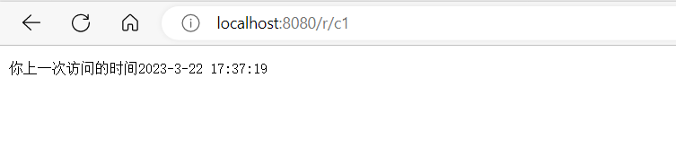

## 7.4 Session（重点）

**访问网站的时候，Session会在服务器保存。**

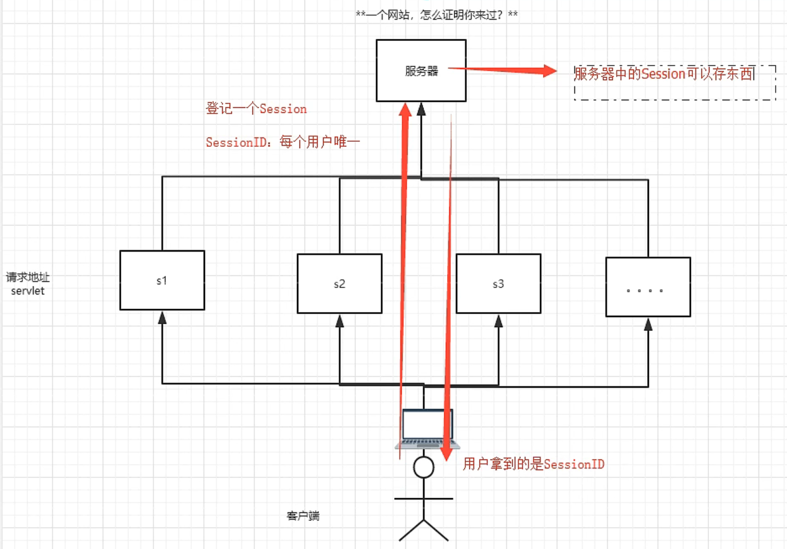

什么是Session：

- 服务器会给每一个用户（浏览器）创建一个Seesion对象；
- 一个Seesion独占一个浏览器，只要浏览器没有关闭，这个Session就存在；
- **用户登录之后，整个网站它都可以访问！—> 保存用户的信息；用户的权限等等**

使用Session：

```java
//得到Session
HttpSession session = req.getSession();
//给Session中存数据
session.setAttribute("name","admin");
//获取Session中的数据
session.getAttribute("name");
//删除Session中的数据
session.removeAttribute("name");
//获取Session的ID
String sessionId = session.getId()
//手动注销Session
session.invalidate();
```

**会话自动过期：web.xml配置**

```java
<!--设置Session默认的失效时间-->
<session-config>
<!--15分钟后Session自动失效，以分钟为单位-->
<session-timeout>15</session-timeout>
</session-config>
```

### 1. **共享数据**

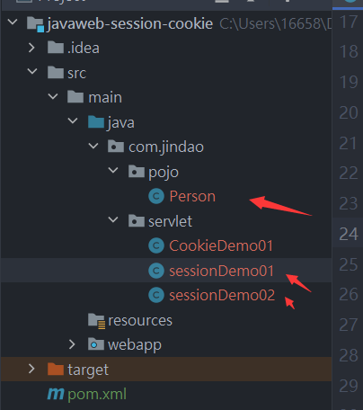

**sessionDemo01**

```java
public class sessionDemo01 extends HttpServlet {
	@Override
	protected void doGet(HttpServletRequest req, HttpServletResponse resp) throws ServletException, IOException {
		req.setCharacterEncoding("utf-16");
		resp.setCharacterEncoding("utf-16");
		// 得到session数据
		HttpSession session = req.getSession();
		// 给session中存入东西(可以是对象)
		session.setAttribute("name", new Person("小明", 18));
		//获得session的id
		String id = session.getId();
		// 判断session是不是新的创建
		if (session.isNew()){
			resp.getWriter().write("session创建成功, ID" + id);

		}else {
			resp.getWriter().write("session以及在服务器中存在了, ID" + id);
		}
	}
}

```

**sessionDemo02**

```java
public class sessionDemo02 extends HttpServlet {
	@Override
	protected void doGet(HttpServletRequest req, HttpServletResponse resp) throws ServletException, IOException {
		req.setCharacterEncoding("utf-16");
		resp.setCharacterEncoding("utf-16");
		// 得到session数据
		HttpSession session = req.getSession();
		// 得到session中存入东西
		Person name = (Person) session.getAttribute("name");
		System.out.println(name);
	}
}
```

**person**

```java
public class Person {
	private String name;
	private  int age;

	public Person() {
	}

	public Person(String name, int age) {
		this.name = name;
		this.age = age;
	}

	public Person(String name) {
		this.name = name;
	}

	public Person(int age) {
		this.age = age;
	}

	public String getName() {
		return name;
	}

	public void setName(String name) {
		this.name = name;
	}

	public int getAge() {
		return age;
	}

	public void setAge(int age) {
		this.age = age;
	}

	@Override
	public String toString() {
		return "Person{" +
				"name='" + name + '\'' +
				", age=" + age +
				'}';
	}
}
```

效果:

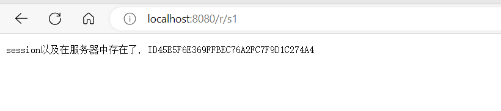

输入 [localhost:8080/r/s2](http://localhost:8080/r/s2)得到:


### 2. 注销

手动注销

```java
public class sessionDemo03 extends HttpServlet {
	@Override
	protected void doGet(HttpServletRequest req, HttpServletResponse resp) throws ServletException, IOException {
		HttpSession session = req.getSession();
		// 手动注销 (不用)
		session.removeAttribute("小明");
		session.invalidate();  // 注销-->相当于关闭浏览器

	}
}
```

自动注销

```xml
<web-app>
  <display-name>Archetype Created Web Application</display-name>
  
  <!--设置session默认的失效时间-->
  <session-config>
    <!--15分钟后session自动失效，以分钟为单位-->
    <session-timeout>15</session-timeout>
  </session-config>
  
</web-app>
```

### 3. **Session和cookie的区别**

- Cookie是把用户的数据写给用户的浏览器，浏览器保存 （可以保存多个）
- Session把用户的数据写到用户独占Session中，服务器端保存 （保存重要的信息，减少服务器资源的浪费）
- **Session对象由服务器创建；访问网站的时候，Session会在服务器保存。**

使用场景：

- 保存一个登录用户的信息；
- 在整个网站中经常会使用的数据，将它保存在Session中；
- 购物车信息

# 8. JSP

## 8.1 什么是JSP

**Java Server Pages ： Java服务器端页面，也和Servlet一样，用于动态Web技术**！

最大的特点：

- 写JSP就像在写HTML

- 区别：

  - HTML只给用户提供静态的数据

  - JSP页面中可以嵌入JAVA代码，为用户提供动态数据；


## 8.2 JSP原理

- 服务器内部工作
  - tomcat中有一个work目录；
  - IDEA中使用Tomcat的会在IDEA的tomcat中生产一个work目录

Tomcat部署项目下的`\work\Catalina\localhost\ROOT\org\apache\jsp`

发现页面转变成了Java程序！

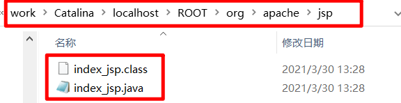

浏览器向服务器发送请求，不管访问什么资源，其实都是在访问Servlet！

**JSP最终也会被转换成为一个Java类**, JSP 本质上就是一个Servlet。

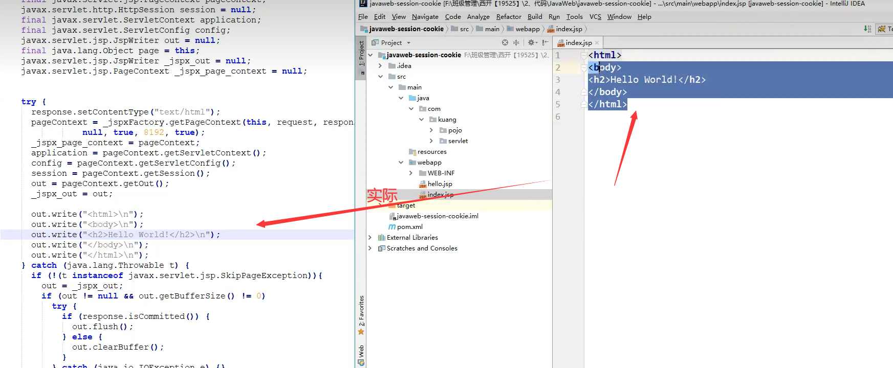

```java
// 初始化
public void _jspInit() {
  }
// 销毁
  public void _jspDestroy() {
  }
// JSPservice
  public void _jspService(final javax.servlet.http.HttpServletRequest request, final javax.servlet.http.HttpServletResponse response)
```

1. 判断请求的方式
2. 内置一些对象（9个）

```java
final javax.servlet.jsp.PageContext pageContext;    // 页面上下文
javax.servlet.http.HttpSession session = null;        // session
final javax.servlet.ServletContext application;        // applicationContext
final javax.servlet.ServletConfig config;            // config
javax.servlet.jsp.JspWriter out = null;                // out
final java.lang.Object page = this;                    // page：当前
HttpServletRequest request;                            // 请求
HttpServletResponse response;                        // 响应
```

输出页面前增加的代码

```java
response.setContentType("text/html;charset=UTF-8");// 设置响应的页面类型
pageContext = _jspxFactory.getPageContext(this, request, response,
         null, true, 8192, true);
_jspx_page_context = pageContext;
application = pageContext.getServletContext();
config = pageContext.getServletConfig();
session = pageContext.getSession();
out = pageContext.getOut();
_jspx_out = out;
```

以上的内置对象可以在jsp页面中直接使用

在JSP页面中；  只要是JAVA代码就会原封不动的输出；
如果是HTML代码，就会被转换为：

```java
out.write("<html>\r\n");
```

**原理图:**

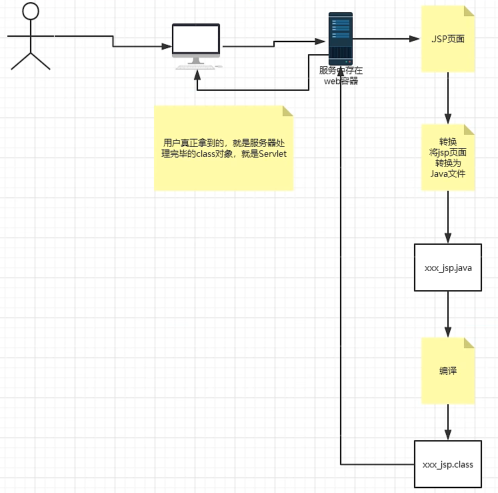

## 8.3 JSP基础语法(了解)

JSP 作为java技术的一种应用，它拥有一些自己扩充的语法（了解，知道即可！），可支持Java所有语法！

### JSP表达式(用来将程序的输出)

```jsp
<%--JSP表达式
作用：用来将程序的输出，输出到客户端，可以写JAVA代码。 <%= 变量或者表达式%>
--%>

<%= new java.util.Date()%>
```

### jsp脚本片段

```jsp
<%--jsp脚本片段--%>

<%
    int sum = 0;
    for (int i = 1; i <=100 ; i++) {
        sum+=i;
    }
    out.println("<h1>Sum="+sum+"</h1>");
%>

<%--下面可以正常写html代码--%>
<p>
    今天天气好。
</p>

<%--Java代码和HTML穿插使用--%>

<%
    for (int i = 0; i < 5; i++) {
%>
    <h1>Hello,World <%=i%> </h1>
<%
    }
%>
```

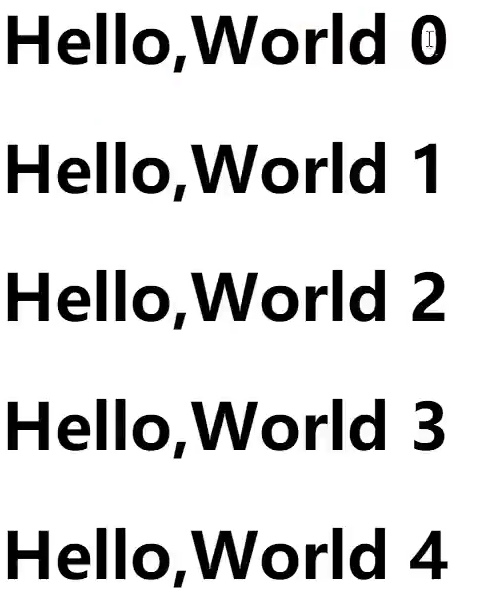

### JSP声明

```jsp
<%!
static {
    System.out.println("Loading Servlet!");
}
private int globalVar = 0;
public void demo(){
    System.out.println("demo--->！");
}
%>
```

**JSP声明：会被编译到JSP生成Java的类中！ 其他的(表达式/脚本片段)，就会被生成到_jspService方法中！**

在JSP，嵌入Java代码即可！

### JSP注释

```jsp
<%--注释--%>
```

**JSP的注释，不会在客户端显示，HTML注释就会！**

## 8.4 JSP指令

1. **定制错误页面**

   ```jsp
   <%--定制错误页面--%>
   <%@ page errorPage="error/500.jsp" %>
   ```

   或者

   **在web.xml定制全局的错误页面**
   

### 包含上下文

1. **包含头部和尾部**

   头部和尾部是所有页面共有的那种

   ```jsp
   <%@page args.... %>
   <%@include file=""%>
   <%-- jsp指令
       @include会将两个页面合二为一
   --%>
   <%@include file="common/header.jsp"%>
   <h1>网页主体</h1>
   <%@include file="common/footer.jsp"%>
   <hr>
   
   
   <%-- jsp标签
   	jsp:include：拼接页面，本质还是三个
   --%>
   <jsp:include page="/common/header.jsp"/>
   <h1>网页主体</h1>
   <jsp:include page="/common/footer.jsp"/>
   ```

   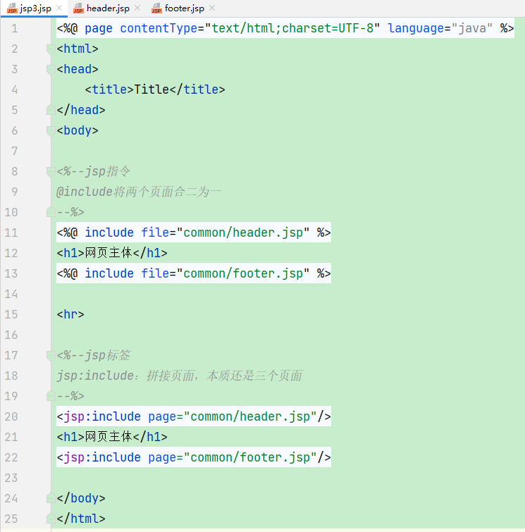


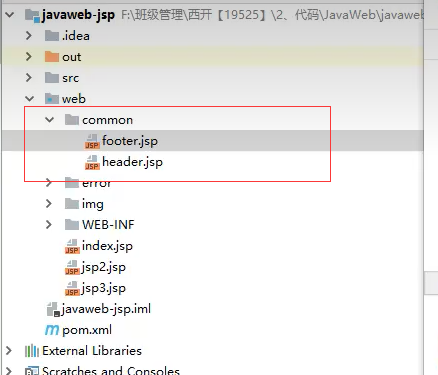

**运行效果:**

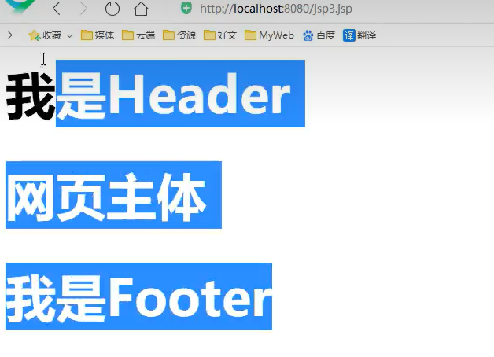

## 8.5 九大内置对象

   - PageContext `存东西`
   - Request `存东西`
   - Response
   - Session `存东西`
   - Application（ServletContext） `存东西`
   - Config（ServletConfig）
   - out
   - page
   - exception

存东西的区别

   ```java
   pageContext.setAttribute("name1","张三1");// 保存的数据只在一个页面中有效
   request.setAttribute("name2","张三2");// 保存的数据只在一次请求中有效，请求转发会携带这个数据
   session.setAttribute("name3","张三3");// 保存的数据只在一次会话中有效，从打开浏览器到关闭浏览器
   application.setAttribute("name4","张三4");// 保存的数据只在服务器中有效，从打开服务器到关闭服务器
   ```

**request**：客户端向服务器发送请求，产生的数据，可能过会就用不上了，例：某个文章！

**session**：客户端向服务器发送请求，产生的数据，可能用完了还要用，例：用户信息；

**application**：客户端向服务器发送请求，产生的数据，一个用户用完了，其他用户还可能使用。例：全局参数。

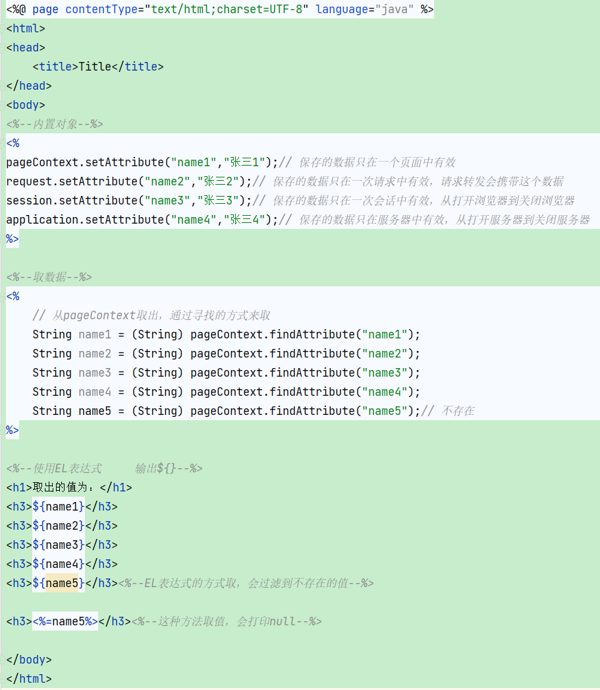

```java
<html>
<body>
<%@page contentType="text/html; charset=utf-8" pageEncoding="UTF-8" %>
<h2>Hello World!</h2>

<%--内置对象--%>
<%
    pageContext.setAttribute("name1", "小明1");  // 保存的数据只在一个页面中有效
    request.setAttribute("name2", "小明2");     // 保存的数据一次请求中有效，请求转发会携带这个数据
	session.setAttribute("name3", "小明3");  // 保存的数据只在一次会话中有效, 从打开浏览器到关闭浏览器
    application.setAttribute("name4", "小明4"); // 保存的数据只在服务器中有效，从打开浏览器到关闭浏览器
%>

<%
    //从pageContext取出，通过寻找的方式来取
    String name1 =(String)pageContext.findAttribute("name1");
    String name2 =(String)pageContext.findAttribute("name2");
    String name3 =(String)pageContext.findAttribute("name3");
    String name4 =(String)pageContext.findAttribute("name4");
    //String name5 =(String)pageContext.findAttribute("name5");            //  不存在
    out.println(name1);
%>

</body>
</html>

```

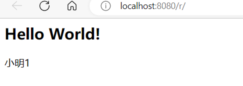

## 8.6 jsp标签、JSTL标签、EL表达式

### **JSP标签**

JSP自带比较简单的标签。

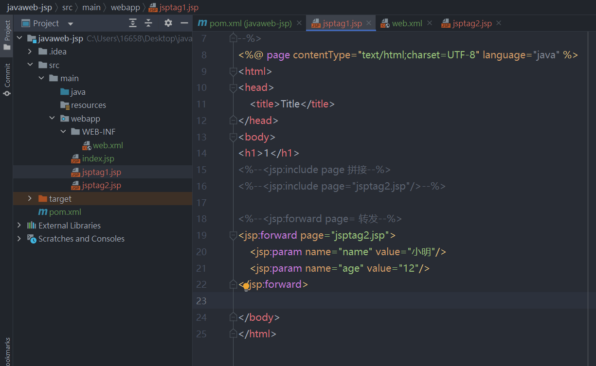

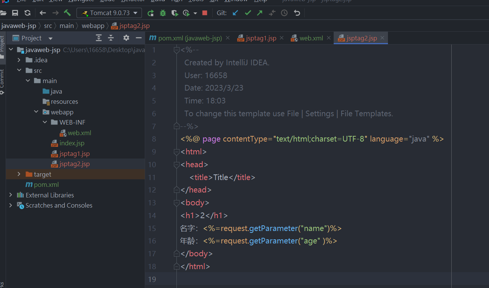

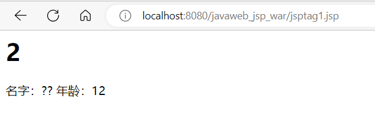

### **JSTL表达式**

扩展很多自定义标签。

#### **EL表达式**： `${ }`

- 获取数据
- 执行运算
- 获取web开发的常用对象

**JSTL表达式**

JSTL支持通用的、结构化的任务，比如迭代，条件判断，XML文档操作，国际化标签，SQL标签。

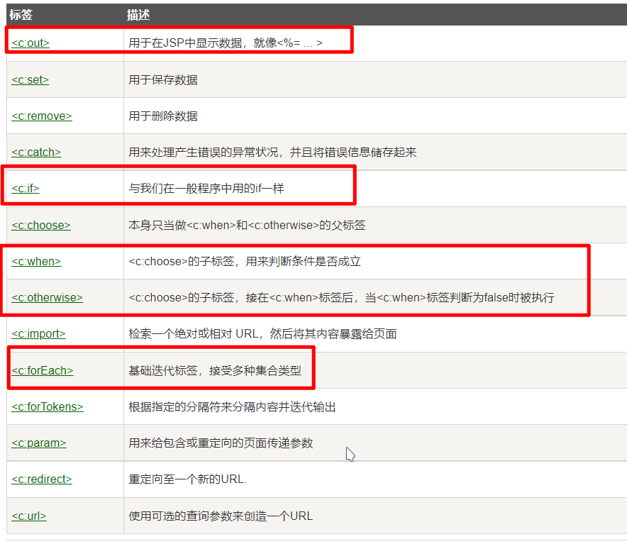

#### 所需仓库

```xml
<!-- JSTL表达式的依赖 -->
<dependency>
    <groupId>javax.servlet.jsp.jstl</groupId>
    <artifactId>jstl-api</artifactId>
    <version>1.2</version>
</dependency>
<!-- standard标签库 -->
<dependency>
    <groupId>taglibs</groupId>
    <artifactId>standard</artifactId>
    <version>1.1.2</version>
</dependency>
```


# 9. mvc三层架构

## 10.过滤器（Filter）

Filter：过滤器，用来过滤网站的数据：

- 处理中文乱码。
- 登录验证。

Filter开发步骤：
